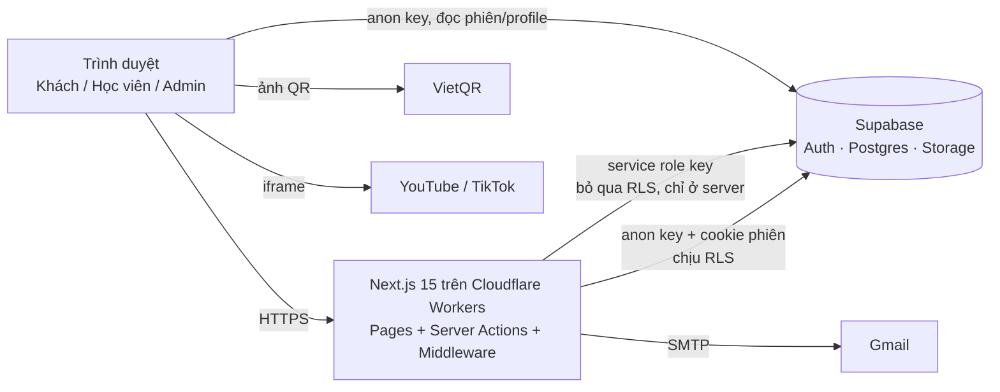
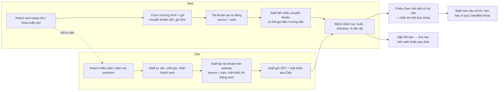

# Tổng quan dự án

## 1. Thông tin chung

| Mục | Nội dung |
| --- | --- |
| Tên sản phẩm | Trung tâm HV – Nền tảng khóa học online |
| Thương hiệu | Holistic Therapy Center for Vietnamese – *Trị liệu toàn diện cho người Việt* |
| Chủ sở hữu nội dung | Bác sĩ Đỗ Mạnh Cường (CEO & bác sĩ chuyên môn) |
| Lĩnh vực | Chương trình tập luyện, phục hồi chức năng cột sống theo chuẩn y khoa, có chuyên gia hướng dẫn (từ v0.2); trước đó: khóa học nắn chỉnh, trị liệu cột sống – cơ xương khớp |
| Loại hệ thống | Website bán chương trình tập + LMS (buổi tập, checklist, tiến độ) + trang quản trị tập trung cho admin và nhân viên |
| Ngôn ngữ giao diện | Tiếng Việt (múi giờ hiển thị `Asia/Ho_Chi_Minh`, tiền tệ VNĐ) |
| Phiên bản mã nguồn | 0.1.0 (đang thiết kế 0.2 – xem §9) |

## 2. Bối cảnh & vấn đề

Trung tâm muốn bán khóa học video cho khách hàng phổ thông (nhiều người lớn tuổi, dùng điện thoại,
không quen email). Yêu cầu cốt lõi:

- Thanh toán **chuyển khoản ngân hàng** (quen thuộc ở Việt Nam), không tích hợp cổng thanh toán.
- Trung tâm **xác nhận thủ công** từng giao dịch dựa trên ảnh chụp chuyển khoản.
- Khách đăng ký **không bắt buộc có email**, đăng nhập bằng **số điện thoại**.
- Video lưu trên **YouTube/TikTok** (miễn phí, không cần hạ tầng video).
- Chỉ học viên đã được duyệt mới xem được bài học của **đúng khóa** đã mua.

## 3. Mục tiêu

| Mã | Mục tiêu | Chỉ số đo |
| --- | --- | --- |
| G1 | Khách đăng ký & gửi chứng từ thanh toán trong một lần | ≤ 3 bước, ≤ 3 phút trên điện thoại |
| G2 | Admin duyệt đơn nhanh | Duyệt 1 đơn ≤ 2 thao tác (xem ảnh → bấm Duyệt) |
| G3 | Bảo vệ nội dung trả phí | 0 bài học lộ ra cho tài khoản chưa được duyệt (kiểm soát bằng RLS) |
| G4 | Vận hành chi phí thấp | Supabase Free + Cloudflare Workers Paid (~5 USD/tháng, hợp lệ thương mại – ADR-017) |
| G5 | Tự phục vụ tài khoản | Học viên tự đổi thông tin, mật khẩu, lấy lại mật khẩu qua email |

## 4. Phạm vi

### Trong phạm vi (đã triển khai)

- Landing page giới thiệu trung tâm, bác sĩ, danh sách khóa học, FAQ, CTA.
- Box đăng ký 3 bước (QR VietQR → chụp ảnh chuyển khoản → điền thông tin & tải ảnh).
- Tạo tài khoản tự động khi đăng ký; đăng nhập bằng email hoặc SĐT.
- Quên mật khẩu bằng mã 6 số qua email.
- Trang "Tài khoản của tôi", "Khóa học của tôi", chi tiết khóa, trang xem bài học.
- Trang quản trị: đơn đăng ký (duyệt/từ chối/thu hồi), học viên, khóa học, bài học.
- Kiểm thử end-to-end tự động trên trình duyệt thật.

### Ngoài phạm vi (hiện tại)

- Cổng thanh toán online, đối soát tự động với ngân hàng.
- Lưu trữ/bảo vệ video (DRM), theo dõi tiến độ học, bài kiểm tra, chứng chỉ.
- Thông báo tự động (email/Zalo/SMS) khi đơn được duyệt.
- Đa ngôn ngữ, ứng dụng di động native.
- Nhiều cấp quản trị (chỉ có `user` và `admin`). → **v0.2 thêm `staff`** (xem §9).

Xem [10-review/roadmap.md](../10-review/roadmap.md) cho các hạng mục mở rộng.

## 5. Stakeholder

| Vai trò | Mô tả | Quan tâm chính |
| --- | --- | --- |
| Chủ trung tâm / Bác sĩ | Chủ sở hữu sản phẩm, người tạo nội dung | Doanh thu, uy tín, bảo vệ nội dung |
| Admin (quản trị viên) | Toàn quyền: nội dung khóa học, gói giá, phân quyền, doanh thu, xem mọi thông tin | Kiểm soát, số liệu tập trung |
| Staff (nhân viên tư vấn, từ v0.2) | Kiểm tra đơn, tạo tài khoản bệnh nhân từ Zalo, cấp gói, theo dõi tiến độ, xử lý phiếu tham vấn và khách quan tâm premium | Thao tác nhanh, không nhầm lẫn, làm song song với Zalo |
| Bệnh nhân (học viên, `role = user`) | Người tập chương trình phục hồi chức năng | Đăng ký dễ, tập trên điện thoại, biết mình tập đến đâu, được bác sĩ tham vấn |
| Đội chuyên gia (giai đoạn sau) | Bác sĩ, HLV Yoga/Pilates/PT học khóa chuyên môn | Chưa làm ở v0.2 (chỉ chuẩn bị trường `audience`) |
| Khách truy cập | Người tìm hiểu | Thông tin rõ ràng, liên hệ nhanh (hotline, Zalo) |
| Đội phát triển | Bảo trì, mở rộng | Code rõ ràng, tài liệu đầy đủ, test tự động |

## 6. Công nghệ

| Tầng | Công nghệ | Phiên bản | Ghi chú |
| --- | --- | --- | --- |
| Framework | Next.js (App Router, Server Components, Server Actions) | ^14.2.35 | |
| UI | React | ^18 | |
| Ngôn ngữ | TypeScript | ^5 | `strict` theo `tsconfig.json` |
| CSS | Tailwind CSS + PostCSS + Autoprefixer | ^3 | Design token trong `tailwind.config.ts` |
| Font | Be Vietnam Pro (next/font/google) | — | Hỗ trợ tiếng Việt |
| Backend-as-a-Service | Supabase: Auth, Postgres, Storage | supabase-js ^2.45, @supabase/ssr ^0.5 | Phân quyền bằng RLS |
| Email | Nodemailer qua SMTP (Gmail + App Password) | ^10 | |
| Xử lý ảnh | sharp (tối ưu ảnh Next/Image) | ^0.35 | |
| Kiểm thử E2E | playwright-core (Chrome/Edge có sẵn trên máy) | ^1.63 | `scripts/e2e.mjs` |
| Hosting | Cloudflare Workers (OpenNext) – từ Đợt 17, ADR-017 (trước đó Vercel) | — | |
| Dịch vụ ngoài | VietQR (ảnh QR), YouTube, TikTok (nhúng video), Zalo (link tư vấn) | — | |

## 7. Tóm tắt kiến trúc

Chi tiết: [03-architecture/system-architecture.md](../03-architecture/system-architecture.md).

## 8. Giả định & ràng buộc

- Mọi thanh toán là chuyển khoản vào **một** tài khoản ngân hàng cấu hình trong `lib/site-config.ts`.
- Nội dung chuyển khoản là **số điện thoại** của khách để admin đối chiếu.
- Supabase Auth bắt buộc có email → tài khoản chỉ có SĐT dùng email nội bộ `<SĐT>@sdt.hv.invalid` (xem ADR-003).
- Video YouTube nên để chế độ **Unlisted**; hệ thống không ngăn học viên chia sẻ link video gốc.
- Số lượng dữ liệu dự kiến nhỏ (hàng trăm – vài nghìn học viên); trang admin giới hạn 200 đơn / 200 bệnh nhân mỗi lần tải (lọc / tìm để thu hẹp).

## 9. Định vị lại – phiên bản 0.2 (chốt 27/09/2026)

> Trạng thái (27/09/2026): **✅ đã triển khai toàn bộ yêu cầu v0.2** (Đợt 7 → 13, E2E xem test-plan). Việc còn lại trước khi chạy thật: [roadmap.md](../10-review/roadmap.md) – Đợt 14 (chạy thử MVP, kế hoạch 7 giai đoạn §3.1; cập nhật 02/10/2026).

### 9.1. Tầm nhìn
Nền tảng dạy cho **bệnh nhân** và **đội chuyên gia**; giai đoạn này tập trung vào **bệnh nhân**. Bệnh nhân tập các chương trình
tập luyện, phục hồi chức năng theo chuẩn y khoa, dưới sự hướng dẫn của chuyên gia; nhân viên theo dõi và kết nối với bác sĩ.

### 9.2. Yêu cầu chính

| # | Yêu cầu | Thiết kế |
| --- | --- | --- |
| V-01 | 3 loại khóa: **miễn phí** (ai cũng xem, không cần đăng nhập), **chương trình** trả phí theo gói tháng (nhóm: vẹo lưng, vẹo ngực), **premium** 1:4 / 1:2 / 1:1 (3 khóa riêng, chỉ ảnh bìa + thông tin + giá + nút Zalo) | ADR-012, ADR-015 |
| V-02 | Gói 1 / 3 / 6 / 12 tháng, giá riêng từng chương trình; 1 tháng = 12 buổi, 3 tháng = 36 buổi; hạn tính từ lúc duyệt, **cộng dồn** khi gia hạn; hết hạn mất quyền xem bài nhưng còn thấy tiến độ và nút Gia hạn | ADR-012 |
| V-03 | Khóa gồm **buổi → bài tập**; admin tùy chọn số buổi, số bài mỗi buổi khi tạo khóa (mặc định 6 bài/buổi) | ADR-013 |
| V-04 | Checklist mỗi buổi (mẫu chung: tick từng bài đã tập); buổi mở **lần lượt**; % tiến độ hiển thị nhỏ; nút hành động khi tập ("Tiếp tục buổi X"); bố cục tham khảo Udemy | ADR-013 |
| V-05 | **Phiếu tham vấn** bác sĩ: bệnh nhân điền và gửi cho nhân viên **bất cứ lúc nào** (và được nhắc khi kết thúc khóa); staff xem câu trả lời | ADR-015 |
| V-06 | Khách đi web ⇄ Zalo; dashboard quản trị tập trung trên website, song song với Zalo | §9.3, dashboard |
| V-07 | Khách từ **website**: tự đăng ký, tài khoản tạo tự động; staff xác nhận chuyển khoản (có thể gọi điện hướng dẫn) → bệnh nhân học khóa đã đăng ký | ADR-006 (giữ) |
| V-08 | Khách từ **Zalo**: staff tạo tài khoản, nhập thông tin bệnh nhân, ghi số tiền & hình thức thanh toán, **mật khẩu hệ thống sinh**; bệnh nhân đăng nhập bằng SĐT/email; lần đầu **nên** đổi mật khẩu (không bắt buộc) | ADR-014 |
| V-09 | 3 vai trò: `user` (bệnh nhân), `staff`, `admin` (cao nhất, toàn quyền, xem tất cả) | ADR-011 |
| V-10 | Premium: nút "Liên hệ Zalo nhận ưu đãi" **lưu khách bấm** và **mở Zalo** | ADR-015 |
| V-11 | Trang **Chính sách bảo mật** + ô đồng ý xử lý dữ liệu (dữ liệu sức khỏe) | RV-17, security-design §6 |
| V-12 | Dữ liệu hiện có: khóa hiện tại chuyển thành loại **chương trình**; chưa có bệnh nhân thật (toàn bộ là dữ liệu test) | database-design §10.7 |

### 9.3. Hai luồng khách hàng

### 9.4. Ngoài phạm vi v0.2
Khóa học cho đội chuyên gia (chỉ chuẩn bị trường `audience`), tài khoản chuyên gia/bác sĩ theo dõi riêng từng bệnh nhân
(staff đảm nhận), đặt lịch hẹn trên web, thông báo Zalo OA/SMS, cổng thanh toán online.
