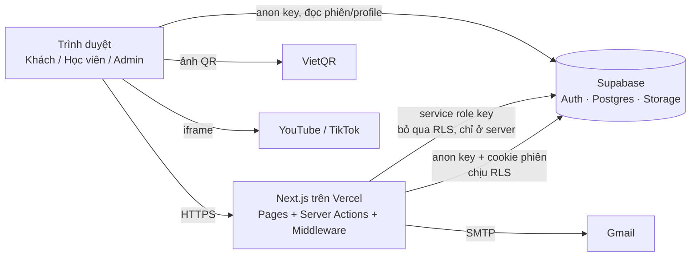

# Tổng quan dự án

## 1. Thông tin chung

| Mục | Nội dung |
| --- | --- |
| Tên sản phẩm | Trung tâm HV – Nền tảng khóa học online |
| Thương hiệu | Holistic Therapy Center for Vietnamese – *Trị liệu toàn diện cho người Việt* |
| Chủ sở hữu nội dung | Bác sĩ Đỗ Mạnh Cường (CEO & bác sĩ chuyên môn) |
| Lĩnh vực | Đào tạo online: nắn chỉnh, trị liệu cột sống – cơ xương khớp |
| Loại hệ thống | Website bán khóa học + LMS tối giản (xem video bài học) + trang quản trị |
| Ngôn ngữ giao diện | Tiếng Việt (múi giờ hiển thị `Asia/Ho_Chi_Minh`, tiền tệ VNĐ) |
| Phiên bản mã nguồn | 0.1.0 |

## 2. Bối cảnh & vấn đề

Trung tâm muốn bán khóa học video cho khách hàng phổ thông (nhiều người lớn tuổi, dùng điện thoại,
không quen email). Yêu cầu cốt lõi:

- Thanh toán **chuyển khoản ngân hàng** (quen thuộc ở Việt Nam), không tích hợp cổng thanh toán.
- Trung tâm **xác nhận thủ công** từng giao dịch dựa trên ảnh chụp chuyển khoản.
- Khách đăng ký **không bắt buộc có email**, đăng nhập bằng **số điện thoại**.
- Video lưu trên **YouTube/TikTok** (miễn phí, không cần hạ tầng video).
- Chỉ học viên đã được duyệt mới xem được bài học của **đúng khóa** đã mua.

## 3. Mục tiêu

| Mã | Mục tiêu | Chỉ số đo |
| --- | --- | --- |
| G1 | Khách đăng ký & gửi chứng từ thanh toán trong một lần | ≤ 3 bước, ≤ 3 phút trên điện thoại |
| G2 | Admin duyệt đơn nhanh | Duyệt 1 đơn ≤ 2 thao tác (xem ảnh → bấm Duyệt) |
| G3 | Bảo vệ nội dung trả phí | 0 bài học lộ ra cho tài khoản chưa được duyệt (kiểm soát bằng RLS) |
| G4 | Vận hành chi phí thấp | Chạy được trên gói miễn phí Vercel + Supabase |
| G5 | Tự phục vụ tài khoản | Học viên tự đổi thông tin, mật khẩu, lấy lại mật khẩu qua email |

## 4. Phạm vi

### Trong phạm vi (đã triển khai)

- Landing page giới thiệu trung tâm, bác sĩ, danh sách khóa học, FAQ, CTA.
- Box đăng ký 3 bước (QR VietQR → chụp ảnh chuyển khoản → điền thông tin & tải ảnh).
- Tạo tài khoản tự động khi đăng ký; đăng nhập bằng email hoặc SĐT.
- Quên mật khẩu bằng mã 6 số qua email.
- Trang "Tài khoản của tôi", "Khóa học của tôi", chi tiết khóa, trang xem bài học.
- Trang quản trị: đơn đăng ký (duyệt/từ chối/thu hồi), học viên, khóa học, bài học.
- Kiểm thử end-to-end tự động trên trình duyệt thật.

### Ngoài phạm vi (hiện tại)

- Cổng thanh toán online, đối soát tự động với ngân hàng.
- Lưu trữ/bảo vệ video (DRM), theo dõi tiến độ học, bài kiểm tra, chứng chỉ.
- Thông báo tự động (email/Zalo/SMS) khi đơn được duyệt.
- Đa ngôn ngữ, ứng dụng di động native.
- Nhiều cấp quản trị (chỉ có `user` và `admin`).

Xem [10-review/roadmap.md](../10-review/roadmap.md) cho các hạng mục mở rộng.

## 5. Stakeholder

| Vai trò | Mô tả | Quan tâm chính |
| --- | --- | --- |
| Chủ trung tâm / Bác sĩ | Chủ sở hữu sản phẩm, người tạo nội dung | Doanh thu, uy tín, bảo vệ nội dung |
| Admin (nhân viên trung tâm) | Duyệt đơn, quản lý khóa học & bài học | Thao tác nhanh, không nhầm lẫn |
| Học viên | Người mua & học khóa học | Đăng ký dễ, học trên điện thoại |
| Khách truy cập | Người tìm hiểu | Thông tin rõ ràng, liên hệ nhanh (hotline, Zalo) |
| Đội phát triển | Bảo trì, mở rộng | Code rõ ràng, tài liệu đầy đủ, test tự động |

## 6. Công nghệ

| Tầng | Công nghệ | Phiên bản | Ghi chú |
| --- | --- | --- | --- |
| Framework | Next.js (App Router, Server Components, Server Actions) | ^14.2.35 | |
| UI | React | ^18 | |
| Ngôn ngữ | TypeScript | ^5 | `strict` theo `tsconfig.json` |
| CSS | Tailwind CSS + PostCSS + Autoprefixer | ^3 | Design token trong `tailwind.config.ts` |
| Font | Be Vietnam Pro (next/font/google) | — | Hỗ trợ tiếng Việt |
| Backend-as-a-Service | Supabase: Auth, Postgres, Storage | supabase-js ^2.45, @supabase/ssr ^0.5 | Phân quyền bằng RLS |
| Email | Nodemailer qua SMTP (Gmail + App Password) | ^10 | |
| Xử lý ảnh | sharp (tối ưu ảnh Next/Image) | ^0.35 | |
| Kiểm thử E2E | playwright-core (Chrome/Edge có sẵn trên máy) | ^1.63 | `scripts/e2e.mjs` |
| Hosting đề xuất | Vercel | — | |
| Dịch vụ ngoài | VietQR (ảnh QR), YouTube, TikTok (nhúng video), Zalo (link tư vấn) | — | |

## 7. Tóm tắt kiến trúc

Chi tiết: [03-architecture/system-architecture.md](../03-architecture/system-architecture.md).

## 8. Giả định & ràng buộc

- Mọi thanh toán là chuyển khoản vào **một** tài khoản ngân hàng cấu hình trong `lib/site-config.ts`.
- Nội dung chuyển khoản là **số điện thoại** của khách để admin đối chiếu.
- Supabase Auth bắt buộc có email → tài khoản chỉ có SĐT dùng email nội bộ `<SĐT>@sdt.hv.invalid` (xem ADR-003).
- Video YouTube nên để chế độ **Unlisted**; hệ thống không ngăn học viên chia sẻ link video gốc.
- Số lượng dữ liệu dự kiến nhỏ (hàng trăm – vài nghìn học viên); trang admin giới hạn 200 đơn / 500 tài khoản mỗi lần tải.
