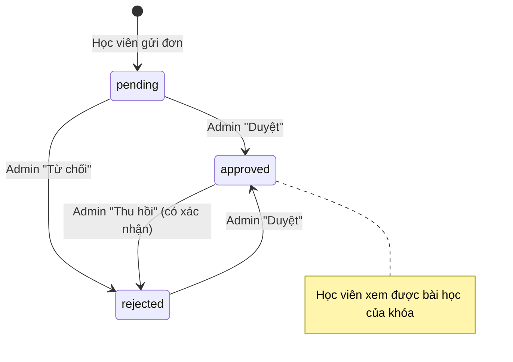

# Quy tắc nghiệp vụ (Business Rules)

Mỗi quy tắc ghi rõ **nơi được thực thi** để khi sửa không bỏ sót. Nếu một quy tắc được thực thi ở
nhiều tầng, phải sửa đồng bộ tất cả các tầng.

## Tài khoản & định danh

| ID | Quy tắc | Thực thi tại |
| --- | --- | --- |
| BR-01 | Mỗi người dùng có đúng 1 profile, tạo tự động khi có user mới | Trigger `on_auth_user_created` → `handle_new_user()` |
| BR-02 | ~~Vai trò chỉ gồm `user` (mặc định) và `admin`~~ → thay bằng **BR-70** (Đợt 7) | `profiles_role_check` |
| BR-03 | Admin đầu tiên tạo bằng script `npm run create-admin`. Sau đó admin đổi vai trò (Học viên / Nhân viên / Admin – BR-71) cho tài khoản khác ở trang Học viên (các admin quyền ngang nhau). **Không** tự đổi quyền của chính mình; luôn còn **ít nhất 1 admin** (database xếp hàng các lần gỡ quyền đồng thời). Mỗi lần đổi quyền ghi vào `role_events` (ai cấp/gỡ, lúc nào) | `scripts/create-admin.mjs`, `setUserRole`, trigger `profiles_guard_role` (RK-13) |
| BR-04 | Số điện thoại là định danh đăng nhập: chuẩn hóa về dạng `0xxxxxxxxx` (10–11 số) | `lib/phone.ts#normalizePhone` |
| BR-05 | Email không bắt buộc. Tài khoản không có email dùng email đăng nhập nội bộ `<SĐT>@sdt.hv.invalid`; email nội bộ **không bao giờ** lưu vào `profiles.email`, không hiển thị ra giao diện, và **không được nhập tay** ở form đăng ký / trang Tài khoản (RK-01) | `lib/phone.ts` (`isValidEmail` từ chối đuôi `@sdt.hv.invalid`), trigger, `registerAction`, `updateProfileAction`, `realEmail()` |
| BR-06 | Email được lưu chữ thường | `registerAction`, `updateProfileAction`, `create-admin` |
| BR-07 | Mỗi SĐT chỉ gắn với một tài khoản | Unique index `profiles_phone_key` + `isPhoneTaken()` |
| BR-08 | Mỗi email chỉ gắn với một tài khoản | Supabase Auth (email unique) + `isEmailTaken()` |
| BR-09 | Mật khẩu tối thiểu **8** ký tự khi tạo / đổi / đặt lại (RV-03). Tài khoản cũ có mật khẩu 6–7 ký tự vẫn đăng nhập được | `lib/password.ts` (`MIN_PASSWORD_LENGTH`) cho form và server action, `create-admin` |
| BR-12 | Chống dò mật khẩu: sai **5 lần** cho cùng tài khoản từ 1 IP (hoặc 30 lần từ 1 IP) trong 15 phút → tạm khóa đăng nhập 15 phút, áp dụng cả tài khoản không tồn tại | `loginAction`, `lib/rate-limit.ts`, hàm `hit_rate_limit` (RK-06) |
| BR-10 | Tài khoản tạo qua đăng ký được coi là đã xác nhận email (admin duyệt thanh toán thay cho bước xác nhận email) | `createUser({ email_confirm: true })` |
| BR-11 | Khi học viên đổi SĐT mà không có email thật, email đăng nhập nội bộ đổi theo SĐT mới | `updateProfileAction` |

## Khóa học & bài học

| ID | Quy tắc | Thực thi tại |
| --- | --- | --- |
| BR-20 | Khóa `published`: hiển thị công khai và nhận đăng ký. Khóa `draft` (**Ẩn = chỉ ngừng nhận đăng ký**): không hiện trên website, không nhận đơn mới, nhưng học viên **đã được duyệt** khóa đó vẫn thấy khóa trong "Khóa học của tôi" và học bình thường; admin thấy mọi khóa | RLS `courses_select` (`status = 'published' or has_course_access(id)`), `getPublishedCourses`, `registerAction` |
| BR-21 | Giá là số nguyên VNĐ từ 0 đến 1.000.000.000; `0` nghĩa là "Liên hệ" (QR không điền số tiền) | `formatPrice`, `vietQrUrl`, input `min=0`, `readCourse` (server), `check courses_price_nonnegative` (DB) |
| BR-22 | Thứ tự hiển thị theo `sort_order` tăng dần (khóa học và bài học) | Các truy vấn `.order('sort_order')` |
| BR-23 | Xóa khóa học xóa **vĩnh viễn** khóa và toàn bộ bài học (học viên mất quyền xem), nhưng **giữ nguyên mọi đơn đăng ký** làm lịch sử thanh toán: `course_id` thành `null`, tên khóa và học phí vẫn còn trong đơn. Đơn của khóa đã xóa không duyệt được nữa | `lessons … on delete cascade`, `registrations.course_id … on delete set null`, `setRegistrationStatus` |
| BR-24 | Mỗi bài học có đúng 1 link video **https** YouTube (`watch?v=`, `youtu.be`, `/shorts/`, `/embed/`) hoặc TikTok (`/video/`, `/embed/v2/`, `/player/v1/`); link khác bị từ chối khi lưu. Bài cũ có link không hợp lệ: admin thấy cảnh báo (danh sách khóa + trang bài học), học viên thấy "Video bài học đang được cập nhật", link lạ **không** được nhúng (RK-09) | `lib/video.ts#isSupportedVideoUrl`, `getVideoEmbed`, `readLesson`, trang admin khóa học |
| BR-25 | Chỉ admin được thêm/sửa/xóa khóa học & bài học | RLS + `requireAdmin()` |
| BR-26 | Dữ liệu admin nhập được kiểm tra ở server: tên bắt buộc ≤ 200 ký tự, mô tả ≤ 5000 ký tự, thứ tự là số nguyên trong ±100.000, trạng thái ∈ {draft, published}, mã (ID) phải là UUID | `app/admin/actions.ts` |

## Đơn đăng ký & thanh toán

| ID | Quy tắc | Thực thi tại |
| --- | --- | --- |
| BR-30 | Thanh toán bằng chuyển khoản vào tài khoản trung tâm; **nội dung chuyển khoản = SĐT của khách** | `RegisterForm` (QR + CopyRow) |
| BR-31 | Mỗi đơn gắn với đúng 1 tài khoản và 1 khóa học lúc tạo, bắt buộc có ảnh chuyển khoản. Xóa tài khoản **giữ nguyên đơn** (`user_id` → `null`, còn snapshot họ tên/SĐT/email); đơn của tài khoản đã xóa không duyệt được, admin thấy "(tài khoản đã xóa)" (RK-03) | `registerAction`, `registrations.user_id … on delete set null`, `setRegistrationStatus` |
| BR-32 | Ảnh chuyển khoản: JPG/PNG/WEBP/HEIC/HEIF, tối đa 5MB. Server xác định định dạng theo **nội dung file** (magic bytes), không tin MIME/đuôi file (RK-08) | Client, `lib/image-type.ts` + `registerAction`, cấu hình bucket |
| BR-33 | Đơn mới luôn ở trạng thái `pending` | Default cột `status` |
| BR-34 | Một học viên không thể có 2 đơn `pending`/`approved` cho cùng một khóa. Được đăng ký lại nếu đơn cũ bị `rejected`. Admin duyệt lại đơn cũ khi học viên đã có đơn khác đang hiệu lực cũng bị chặn | `registerAction` (thông báo thân thiện) + unique index một phần `registrations_active_key` (chặn gửi đồng thời, RK-07) |
| BR-35 | Đơn chỉ được tạo từ server bằng service role; client không có quyền insert | Không có policy insert trên `registrations` |
| BR-48 | Mỗi IP gửi tối đa **20 đơn / giờ** (tính các lần đã qua kiểm tra dữ liệu); nếu bật Turnstile thì phải qua xác minh chống bot. Yêu cầu mã quên mật khẩu tối đa 10 lần / giờ / IP | `registerAction`, `requestCode`, `lib/rate-limit.ts`, `lib/turnstile.ts` (RK-06) |
| BR-49 | Đơn **chờ duyệt** của khóa **đã xóa**: học viên thấy "Khóa học đã ngừng… để được hỗ trợ hoàn tiền"; admin có tab "Khóa đã xóa – cần hoàn tiền" (chỉ hiện khi có đơn), liên hệ hoàn tiền rồi Từ chối kèm lý do | `app/courses/page.tsx`, `app/admin/page.tsx` (RK-04) |
| BR-36 | Chuyển trạng thái đơn: xem sơ đồ dưới. Chỉ nhân viên và admin được chuyển. Admin chỉ chuyển được từ **trạng thái đang thấy trên trang**: nếu admin khác vừa xử lý đơn thì thao tác bị từ chối ("Đơn đã thay đổi…"), không ghi đè (RK-11) | RLS `registrations_staff_update`, `setRegistrationStatus` (`.eq('status', expected)`) |
| BR-46 | Từ chối / Thu hồi có ô **lý do** (không bắt buộc, ≤ 500 ký tự); học viên thấy lý do ở "Đơn chưa được xác nhận". Duyệt hoặc về "Chờ duyệt" thì xóa lý do; lý do không sửa được nếu trạng thái không đổi | `setRegistrationStatus`, trigger `registrations_stamp_review`, cột `review_note` (R-05) |
| BR-47 | Mỗi lần đổi trạng thái đơn ghi 1 dòng lịch sử (người xử lý, trạng thái trước → sau, lý do, thời điểm). Chỉ database ghi; admin chỉ đọc, không ai sửa/xóa qua API. Bảng admin có mục "Lịch sử (n)" | Bảng `registration_events` + trigger (RK-12) |
| BR-37 | `reviewed_at` = thời điểm duyệt/từ chối/thu hồi gần nhất; `reviewed_by` / `reviewed_by_name` = admin đã thực hiện (tên lưu kèm để vẫn biết khi tài khoản admin bị xóa). Database tự ghi theo phiên đăng nhập, không sửa tay được; về `pending` thì xóa cả ba. Bảng admin hiện cột **Người xử lý** (các admin quyền ngang nhau) | Trigger `registrations_stamp_review` |
| BR-39 | Đơn `pending` (hoặc `rejected`) của khóa **đang ẩn** vẫn duyệt được: khách đã chuyển khoản trước khi khóa ngừng nhận đăng ký. Khóa ẩn không có trong ô chọn khóa và server từ chối đơn mới → sau khi ẩn không phát sinh đơn mới. Bảng admin ghi "(khóa đang ẩn)" cạnh tên khóa (RK-05, chốt 26/09/2026) | `getPublishedCourses`, `registerAction` (`status = 'published'`), `setRegistrationStatus` |
| BR-38 | Thông tin trên đơn (họ tên, email, SĐT, **tên khóa `course_title`, học phí `amount`**) là **ảnh chụp tại thời điểm đăng ký**, không tự cập nhật khi học viên sửa profile hay admin sửa/xóa khóa học | `registerAction`, bảng `registrations` |

> Ghi chú: action `setRegistrationStatus` hỗ trợ chuyển về `pending`, nhưng giao diện hiện **không** có nút này.

## Quyền truy cập nội dung

| ID | Quy tắc | Thực thi tại |
| --- | --- | --- |
| BR-40 | Học viên được xem bài học của khóa X ⇔ tồn tại ≥ 1 đơn `approved` của học viên cho khóa X | Hàm `has_course_access()` + RLS `lessons_select` |
| BR-41 | Nhân viên và admin xem được mọi khóa và bài học (xem trước) | `is_staff()` trong `has_course_access()` |
| BR-42 | Thu hồi (approved → rejected) làm mất quyền xem ngay lập tức | RLS đánh giá mỗi truy vấn |
| BR-43 | Học viên chỉ xem được đơn và profile của chính mình | RLS `registrations_select`, `profiles_select` |
| BR-44 | Ảnh chuyển khoản chỉ nhân viên và admin xem được | Storage policy `payment_proofs_staff_select` |

| BR-45 | Khóa đang ẩn vẫn đọc được bởi học viên đã được duyệt khóa đó (xem BR-20); khách và học viên chưa mua nhận trang 404 | RLS `courses_select` |

> Đã chốt (RV-01, 26/09/2026): **Ẩn = chỉ ngừng nhận đăng ký**, học viên đã mua vẫn học được.
> Đã chốt (RK-05, 26/09/2026): đơn đang chờ của khóa ẩn vẫn duyệt được; không nhận đơn mới cho khóa ẩn (BR-39).

## Quy tắc phiên bản 0.2 (chốt 27/09/2026, chưa triển khai)

Các quy tắc dưới đây **thay thế hoặc mở rộng** quy tắc cũ khi đợt tương ứng hoàn thành (cột "Thay"). Khi triển khai, cập nhật
cột "Thực thi tại" và đánh dấu quy tắc cũ là đã thay thế.

### Vai trò (ADR-011)

| ID | Quy tắc | Thay | Thực thi tại (dự kiến) |
| --- | --- | --- | --- |
| BR-70 | ✅ Vai trò gồm `user` (bệnh nhân, mặc định), `staff`, `admin`. Admin là quyền cao nhất | BR-02 | `profiles_role_check`, `lib/auth.ts` (`Role`) |
| BR-71 | ✅ Chỉ **admin** đổi vai trò của tài khoản khác; không tự đổi quyền mình; luôn còn ≥ 1 admin; mỗi lần đổi ghi `role_events`. Script/service role vẫn đổi được | BR-03 | `setUserRole` (`requireAdmin`), trigger `guard_role_change` ("Chỉ admin được thay đổi vai trò tài khoản.") |
| BR-72 | 🟡 (Đợt 7: duyệt/từ chối/thu hồi đơn, xem học viên, xem ảnh chuyển khoản, xem trước khóa học, sửa profile `role = user` ở database; các quyền còn lại theo đợt tương ứng) Staff được: duyệt/từ chối/thu hồi đơn; tạo, sửa thông tin, cấp gói, cấp lại mật khẩu cho tài khoản `role = 'user'`; xử lý phiếu tham vấn, lead; xem dashboard không có doanh thu; xem trước nội dung khóa | BR-25, BR-36, BR-41 | `requireStaff`, `run({ staff: true })`, `is_staff()`, policy `profiles_staff_update`, `registrations_staff_update`, `registration_events_staff_select`, `payment_proofs_staff_select`; middleware |
| BR-73 | ✅ (Đợt 7 cho khóa học/bài học/phân quyền) Chỉ admin được: thêm/sửa/xóa khóa, buổi, bài, gói, ảnh bìa; sửa mẫu phiếu tham vấn; xem doanh thu; sửa tài khoản staff/admin | BR-25 | `requireAdmin`, `is_admin()` |

### Loại khóa & gói (ADR-012)

| ID | Quy tắc | Thay | Thực thi tại (dự kiến) |
| --- | --- | --- | --- |
| BR-74 | Khóa có 1 trong 3 loại: `free`, `program`, `premium`. Đổi loại khi đã có đơn đăng ký bị chặn | — | `check`, `updateCourse` |
| BR-75 | Khóa `free` đang hiển thị: ai cũng xem đề cương và video, không cần đăng nhập, không khóa tuần tự, không nhận đơn | BR-40 | `can_view_lesson`, `registerAction` |
| BR-76 | Khóa `premium`: không có buổi/bài, không có gói, không nhận đơn; hiển thị ảnh bìa, thông tin, giá (`courses.price`, `0` = "Liên hệ") và nút liên hệ Zalo | — | UI, `registerAction` |
| BR-77 | Khóa `program` bán theo gói `months ∈ {1,3,6,12}`, mỗi chương trình tối đa 1 gói cho mỗi số tháng, giá riêng từng chương trình (0 – 1 tỷ), `sessions` = số buổi được mở, mặc định `12 × months` (1 – 500) | BR-21 | `course_plans` (unique `(course_id, months)`, `check`), action admin |
| BR-78 | Chỉ nhận đơn cho chương trình đang hiển thị và gói đang bán; server tính lại giá theo gói, không tin client | BR-20 | `registerAction` |
| BR-79 | Đơn lưu snapshot gói: `plan_id`, `plan_months`, `plan_sessions`, `amount`, cùng `course_title` như cũ | BR-38 | `registerAction`, `createPatientAction` |

### Hạn học & gia hạn (ADR-012)

| ID | Quy tắc | Thay | Thực thi tại (dự kiến) |
| --- | --- | --- | --- |
| BR-80 | Khi đơn chuyển sang `approved`: `access_starts_at = greatest(now(), max(access_until) của các đơn approved khác cùng bệnh nhân + khóa)`, `access_until = access_starts_at + plan_months tháng`. → Gia hạn khi còn hạn thì cộng dồn; hết hạn rồi thì tính từ lúc duyệt | — | Trigger `registrations_stamp_review` |
| BR-81 | Thu hồi (approved → rejected) xóa `access_starts_at/access_until` của đơn đó; không dời các đơn khác (có thể tạo khoảng trống – staff xử lý tay) | BR-42 | Trigger |
| BR-82 | Bệnh nhân có quyền học chương trình X ⇔ có ≥ 1 đơn `approved` cho X với `access_until > now()` **hoặc** `access_until is null` (đơn cũ v0.1) | BR-40 | `has_course_access()` |
| BR-83 | Số buổi được mở của chương trình X = tổng `plan_sessions` của mọi đơn `approved` cho X (kể cả đã hết hạn); đơn cũ v0.1 không có gói → mở toàn bộ | — | `purchased_sessions()` |
| BR-84 | Mỗi bệnh nhân chỉ có **1 đơn `pending`** cho mỗi khóa; được có nhiều đơn `approved` (gia hạn). Đã có đơn đang chờ → báo "Bạn đã có đơn đang chờ xác nhận cho chương trình này" | BR-34 | Unique index `registrations_pending_key`, `registerAction` |
| BR-85 | Hết hạn: không xem được video; vẫn xem đề cương, tiến độ, bài đã tick; thấy nút Gia hạn. Hạn hiển thị theo ngày giờ Việt Nam | — | `can_view_lesson`, UI |

### Buổi, bài tập & tiến độ (ADR-013)

| ID | Quy tắc | Thay | Thực thi tại (dự kiến) |
| --- | --- | --- | --- |
| BR-86 | Chương trình gồm các **buổi** theo `sort_order`; mỗi buổi gồm các **bài tập** theo `sort_order`. Tạo khung nhanh: 1 – 200 buổi × 1 – 20 bài/buổi | BR-22 | `course_sessions`, `generateSkeleton` |
| BR-87 | Link video không bắt buộc; nếu có phải hợp lệ như BR-24. Bài chưa có video: bệnh nhân thấy "Video đang được cập nhật" và vẫn tick được | BR-24 | `readLesson`, trình học |
| BR-88 | Checklist buổi dùng **mẫu chung**: mỗi bài tập là 1 mục "Đã tập"; bệnh nhân tick / bỏ tick bài của mình | — | `lesson_progress`, RLS |
| BR-89 | Buổi thứ k (k ≥ 2) của chương trình mở khi: còn hạn **và** k ≤ số buổi đã mua **và** mọi bài của buổi k-1 đã tick. Buổi không có bài nào coi như đã hoàn thành | — | `can_view_lesson()` (database) |
| BR-90 | Chỉ tick được bài đang xem được (không tick trước buổi bị khóa); đã hết hạn thì không tick / bỏ tick được nhưng không mất tick cũ. Luật mở buổi luôn tính theo **trạng thái tick hiện tại**: bỏ tick 1 bài của buổi trước thì buổi sau khóa lại cho tới khi tick lại (giao diện hỏi xác nhận trước khi bỏ tick) | — | RLS `lesson_progress` |
| BR-91 | Tiến độ % = số bài đã tick / tổng bài trong các buổi đã mua (khóa miễn phí: toàn khóa), làm tròn xuống; hiển thị "x/y bài · z%" | — | `course_progress()` |
| BR-92 | Staff, admin xem mọi bài không bị khóa, không ghi tiến độ | BR-41 | `can_view_lesson()` |
| BR-93 | Link video chỉ trả về qua `get_lesson_video(lesson_id)` khi `can_view_lesson` đúng; đề cương công khai không chứa link | BR-40 | Column privilege + RPC |

### Tài khoản do nhân viên tạo (ADR-014)

| ID | Quy tắc | Thay | Thực thi tại (dự kiến) |
| --- | --- | --- | --- |
| BR-94 | Nhân viên tạo tài khoản bệnh nhân với SĐT (bắt buộc, không trùng) và email (tùy chọn, không trùng); `source = 'zalo'`, `created_by` = nhân viên; bắt buộc xác nhận bệnh nhân đã đồng ý chính sách bảo mật | BR-07, BR-08 | `createPatientAction` |
| BR-95 | Mật khẩu do hệ thống sinh: 8 ký tự từ bảng chữ/số dễ đọc (bỏ `0 O 1 l I`), CSPRNG; chỉ hiển thị một lần; không lưu rõ | BR-09 | `lib/password.ts#generatePassword` |
| BR-96 | `must_change_password = true` khi nhân viên tạo hoặc cấp lại mật khẩu; bệnh nhân được **nhắc** đổi sau đăng nhập (không bắt buộc); đổi thành công → `false` | — | `loginAction`, hộp nhắc, `changePasswordAction` |
| BR-97 | Nhân viên cấp gói: đơn `source = 'staff'`, tạo thẳng `approved`, bắt buộc số tiền (0 – 1 tỷ) và hình thức thanh toán (`bank_transfer` / `cash` / `other`); ảnh chuyển khoản tùy chọn; người xử lý = nhân viên; lịch sử ghi `new → approved` | BR-31, BR-33, BR-35 | `grantPlanAction`, trigger insert |
| BR-98 | Đơn `source = 'web'` bắt buộc có ảnh chuyển khoản; `source = 'staff'` thì không | BR-31 | `check` |
| BR-99 | Cấp lại mật khẩu chỉ áp dụng cho tài khoản `role = 'user'`; ghi `account_events` (ai, lúc nào, không ghi mật khẩu) | — | `resetPatientPasswordAction` |

### Phiếu tham vấn & lead (ADR-015)

| ID | Quy tắc | Thay | Thực thi tại (dự kiến) |
| --- | --- | --- | --- |
| BR-100 | Mẫu phiếu tham vấn là **một mẫu chung** do admin soạn; câu hỏi `check` (có/không), `scale` (0–10), `text` (≤ 500 ký tự); câu hỏi đang tắt không hiện | — | `consult_questions` |
| BR-101 | Bệnh nhân đã đăng nhập gửi phiếu bất cứ lúc nào, tối đa 5 phiếu / ngày; phiếu lưu snapshot câu hỏi + trả lời, không sửa được sau khi gửi | — | `submitConsultationAction`, rate limit |
| BR-102 | Phiếu có trạng thái `new → contacted → done` hoặc `cancelled`; staff/admin đổi trạng thái, ghi chú nội bộ (bệnh nhân không thấy), ghi người xử lý; không ghi đè khi 2 người cùng xử lý (như BR-36) | — | `setConsultationStatus` |
| BR-103 | Bệnh nhân chỉ xem phiếu của mình; staff/admin xem tất cả; không ai xóa phiếu qua API | — | RLS `consultations_*` |
| BR-104 | Nút premium lưu lead (khóa, họ tên, SĐT hợp lệ nếu nhập, người dùng nếu đã đăng nhập) rồi mở Zalo; "Mở Zalo ngay" lưu lượt bấm ẩn danh. Tối đa 20 lead / giờ / IP | — | `createLeadAction`, rate limit |
| BR-105 | Lead có trạng thái `new → contacted → converted` hoặc `closed`; lượt bấm ẩn danh (`phone is null`) chỉ để thống kê, không hiện trong danh sách cần gọi | — | `/admin/leads` |

### Đồng ý xử lý dữ liệu (RV-17)

| ID | Quy tắc | Thay | Thực thi tại (dự kiến) |
| --- | --- | --- | --- |
| BR-106 | Khách tạo tài khoản ở box đăng ký phải tick đồng ý Chính sách bảo mật; lưu `consent_at`, `consent_version`. Học viên cũ chưa có `consent_at` được hỏi một lần sau khi đăng nhập | — | `registerAction`, hộp đồng ý |
| BR-107 | Phiếu tham vấn và tiến độ tập là dữ liệu sức khỏe: chỉ bệnh nhân đó, staff, admin đọc được; không hiển thị trên trang công khai | — | RLS |

## Đặt lại mật khẩu

| ID | Quy tắc | Thực thi tại |
| --- | --- | --- |
| BR-50 | Chỉ tài khoản có email thật mới nhận được mã; tài khoản chỉ có SĐT phải gọi hotline | `requestCode` |
| BR-51 | Mã gồm 6 chữ số, hiệu lực 10 phút, tối đa 5 lần sai | Hằng số trong `app/forgot-password/actions.ts` |
| BR-52 | Mỗi tài khoản chỉ gửi mã 1 lần / 60 giây; mã mới vô hiệu hóa mọi mã cũ chưa dùng | `requestCode` |
| BR-53 | Mã chỉ dùng được 1 lần | `used_at` |

## Hiển thị & định dạng

| ID | Quy tắc |
| --- | --- |
| BR-60 | Tiền tệ: `toLocaleString('vi-VN')` + hậu tố `đ` (VD `1.500.000đ`) |
| BR-61 | Ngày giờ hiển thị theo `Asia/Ho_Chi_Minh`, dạng `dd/mm/yyyy` + `HH:mm` |
| BR-62 | Tên hiển thị trên header: họ tên → email thật → SĐT → "Tài khoản" |
