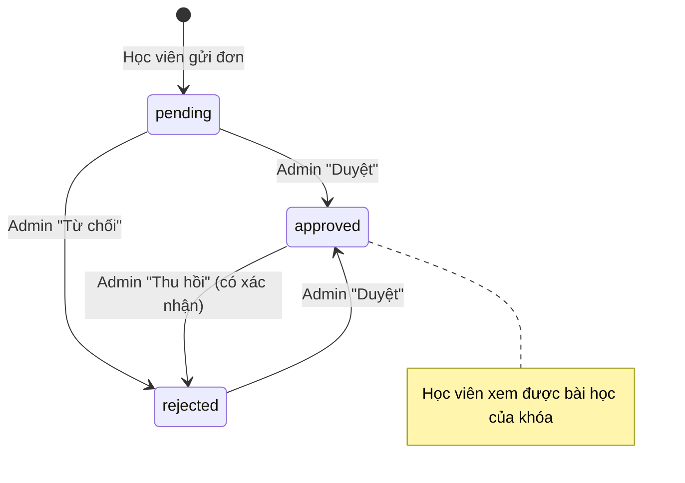

# Quy tắc nghiệp vụ (Business Rules)

Mỗi quy tắc ghi rõ **nơi được thực thi** để khi sửa không bỏ sót. Nếu một quy tắc được thực thi ở
nhiều tầng, phải sửa đồng bộ tất cả các tầng.

## Tài khoản & định danh

| ID | Quy tắc | Thực thi tại |
| --- | --- | --- |
| BR-01 | Mỗi người dùng có đúng 1 profile, tạo tự động khi có user mới | Trigger `on_auth_user_created` → `handle_new_user()` |
| BR-02 | Vai trò chỉ gồm `user` (mặc định) và `admin` | `check (role in ('user','admin'))` |
| BR-03 | Admin chỉ được tạo/nâng quyền bằng script `npm run create-admin` hoặc sửa trực tiếp database | `scripts/create-admin.mjs` |
| BR-04 | Số điện thoại là định danh đăng nhập: chuẩn hóa về dạng `0xxxxxxxxx` (10–11 số) | `lib/phone.ts#normalizePhone` |
| BR-05 | Email không bắt buộc. Tài khoản không có email dùng email đăng nhập nội bộ `<SĐT>@sdt.hv.invalid`; email nội bộ **không bao giờ** lưu vào `profiles.email`, không hiển thị ra giao diện | `lib/phone.ts`, trigger, `registerAction`, `realEmail()` |
| BR-06 | Email được lưu chữ thường | `registerAction`, `updateProfileAction`, `create-admin` |
| BR-07 | Mỗi SĐT chỉ gắn với một tài khoản | Unique index `profiles_phone_key` + `isPhoneTaken()` |
| BR-08 | Mỗi email chỉ gắn với một tài khoản | Supabase Auth (email unique) + `isEmailTaken()` |
| BR-09 | Mật khẩu tối thiểu 6 ký tự | Client `minLength`, server action, Supabase Auth |
| BR-10 | Tài khoản tạo qua đăng ký được coi là đã xác nhận email (admin duyệt thanh toán thay cho bước xác nhận email) | `createUser({ email_confirm: true })` |
| BR-11 | Khi học viên đổi SĐT mà không có email thật, email đăng nhập nội bộ đổi theo SĐT mới | `updateProfileAction` |

## Khóa học & bài học

| ID | Quy tắc | Thực thi tại |
| --- | --- | --- |
| BR-20 | Khóa `published`: hiển thị công khai và nhận đăng ký. Khóa `draft` (**Ẩn = chỉ ngừng nhận đăng ký**): không hiện trên website, không nhận đơn mới, nhưng học viên **đã được duyệt** khóa đó vẫn thấy khóa trong "Khóa học của tôi" và học bình thường; admin thấy mọi khóa | RLS `courses_select` (`status = 'published' or has_course_access(id)`), `getPublishedCourses`, `registerAction` |
| BR-21 | Giá là số nguyên VNĐ từ 0 đến 1.000.000.000; `0` nghĩa là "Liên hệ" (QR không điền số tiền) | `formatPrice`, `vietQrUrl`, input `min=0`, `readCourse` (server), `check courses_price_nonnegative` (DB) |
| BR-22 | Thứ tự hiển thị theo `sort_order` tăng dần (khóa học và bài học) | Các truy vấn `.order('sort_order')` |
| BR-23 | Xóa khóa học xóa **vĩnh viễn** khóa và toàn bộ bài học (học viên mất quyền xem), nhưng **giữ nguyên mọi đơn đăng ký** làm lịch sử thanh toán: `course_id` thành `null`, tên khóa và học phí vẫn còn trong đơn. Đơn của khóa đã xóa không duyệt được nữa | `lessons … on delete cascade`, `registrations.course_id … on delete set null`, `setRegistrationStatus` |
| BR-24 | Mỗi bài học có đúng 1 link video **https** YouTube (`watch?v=`, `youtu.be`, `/shorts/`, `/embed/`) hoặc TikTok (`/video/`, `/embed/v2/`, `/player/v1/`); link khác bị từ chối khi lưu | `lib/video.ts#isSupportedVideoUrl`, `readLesson` |
| BR-25 | Chỉ admin được thêm/sửa/xóa khóa học & bài học | RLS + `requireAdmin()` |
| BR-26 | Dữ liệu admin nhập được kiểm tra ở server: tên bắt buộc ≤ 200 ký tự, mô tả ≤ 5000 ký tự, thứ tự là số nguyên trong ±100.000, trạng thái ∈ {draft, published}, mã (ID) phải là UUID | `app/admin/actions.ts` |

## Đơn đăng ký & thanh toán

| ID | Quy tắc | Thực thi tại |
| --- | --- | --- |
| BR-30 | Thanh toán bằng chuyển khoản vào tài khoản trung tâm; **nội dung chuyển khoản = SĐT của khách** | `RegisterForm` (QR + CopyRow) |
| BR-31 | Mỗi đơn gắn với đúng 1 tài khoản và 1 khóa học, bắt buộc có ảnh chuyển khoản | Cột `not null`, `registerAction` |
| BR-32 | Ảnh chuyển khoản: JPG/PNG/WEBP/HEIC/HEIF, tối đa 5MB | Client, server action, cấu hình bucket |
| BR-33 | Đơn mới luôn ở trạng thái `pending` | Default cột `status` |
| BR-34 | Một học viên không thể có 2 đơn `pending`/`approved` cho cùng một khóa. Được đăng ký lại nếu đơn cũ bị `rejected` | `registerAction` (chỉ kiểm tra ở tầng ứng dụng) |
| BR-35 | Đơn chỉ được tạo từ server bằng service role; client không có quyền insert | Không có policy insert trên `registrations` |
| BR-36 | Chuyển trạng thái đơn: xem sơ đồ dưới. Chỉ admin được chuyển | RLS `registrations_admin_update`, `setRegistrationStatus` |
| BR-37 | `reviewed_at` = thời điểm duyệt/từ chối gần nhất; về `pending` thì xóa | `setRegistrationStatus` |
| BR-38 | Thông tin trên đơn (họ tên, email, SĐT, **tên khóa `course_title`, học phí `amount`**) là **ảnh chụp tại thời điểm đăng ký**, không tự cập nhật khi học viên sửa profile hay admin sửa/xóa khóa học | `registerAction`, bảng `registrations` |

> Ghi chú: action `setRegistrationStatus` hỗ trợ chuyển về `pending`, nhưng giao diện hiện **không** có nút này.

## Quyền truy cập nội dung

| ID | Quy tắc | Thực thi tại |
| --- | --- | --- |
| BR-40 | Học viên được xem bài học của khóa X ⇔ tồn tại ≥ 1 đơn `approved` của học viên cho khóa X | Hàm `has_course_access()` + RLS `lessons_select` |
| BR-41 | Admin xem được mọi khóa và bài học | `is_admin()` |
| BR-42 | Thu hồi (approved → rejected) làm mất quyền xem ngay lập tức | RLS đánh giá mỗi truy vấn |
| BR-43 | Học viên chỉ xem được đơn và profile của chính mình | RLS `registrations_select`, `profiles_select` |
| BR-44 | Ảnh chuyển khoản chỉ admin xem được | Storage policy `payment_proofs_admin_select` |

| BR-45 | Khóa đang ẩn vẫn đọc được bởi học viên đã được duyệt khóa đó (xem BR-20); khách và học viên chưa mua nhận trang 404 | RLS `courses_select` |

> Đã chốt (RV-01, 26/09/2026): **Ẩn = chỉ ngừng nhận đăng ký**, học viên đã mua vẫn học được.

## Đặt lại mật khẩu

| ID | Quy tắc | Thực thi tại |
| --- | --- | --- |
| BR-50 | Chỉ tài khoản có email thật mới nhận được mã; tài khoản chỉ có SĐT phải gọi hotline | `requestCode` |
| BR-51 | Mã gồm 6 chữ số, hiệu lực 10 phút, tối đa 5 lần sai | Hằng số trong `app/forgot-password/actions.ts` |
| BR-52 | Mỗi tài khoản chỉ gửi mã 1 lần / 60 giây; mã mới vô hiệu hóa mọi mã cũ chưa dùng | `requestCode` |
| BR-53 | Mã chỉ dùng được 1 lần | `used_at` |

## Hiển thị & định dạng

| ID | Quy tắc |
| --- | --- |
| BR-60 | Tiền tệ: `toLocaleString('vi-VN')` + hậu tố `đ` (VD `1.500.000đ`) |
| BR-61 | Ngày giờ hiển thị theo `Asia/Ho_Chi_Minh`, dạng `dd/mm/yyyy` + `HH:mm` |
| BR-62 | Tên hiển thị trên header: họ tên → email thật → SĐT → "Tài khoản" |
