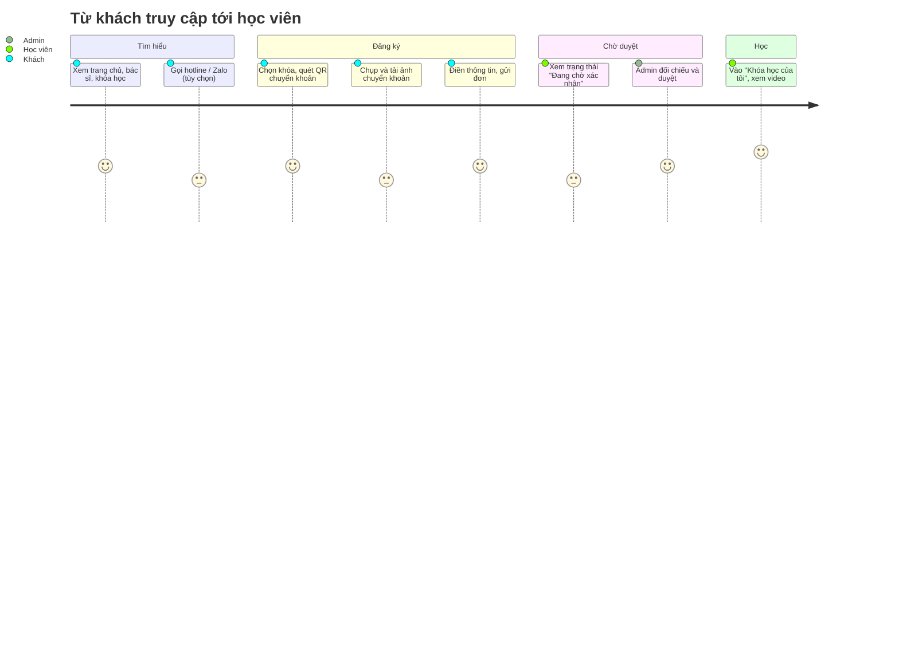
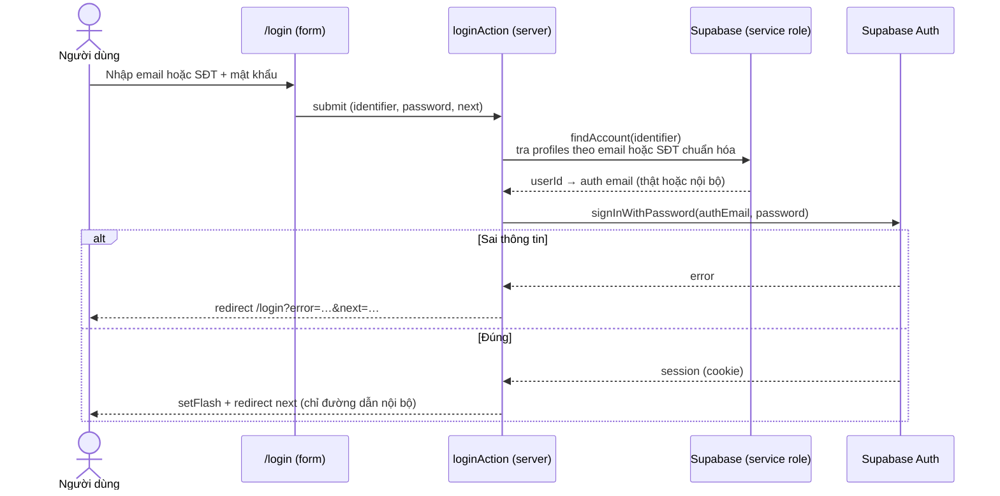
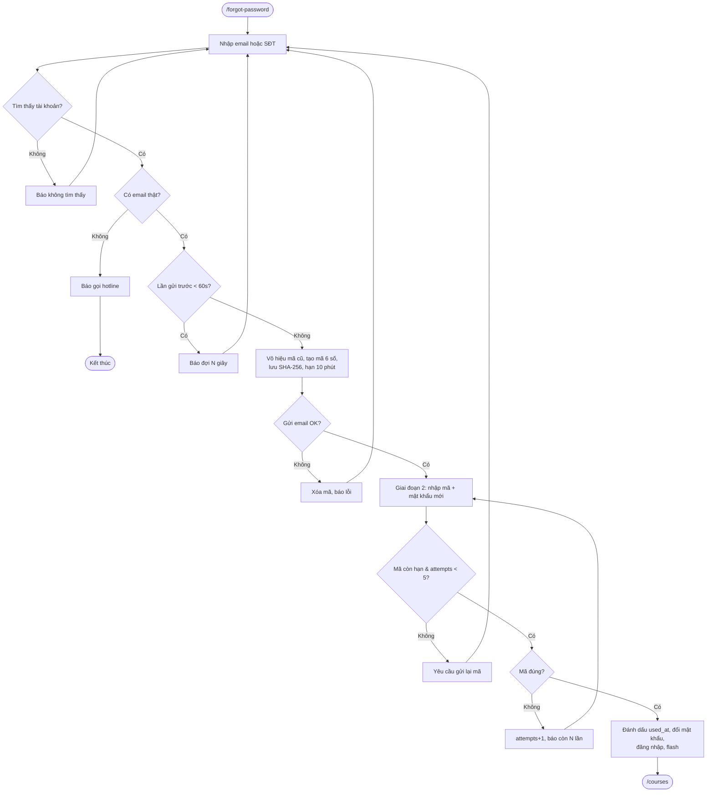
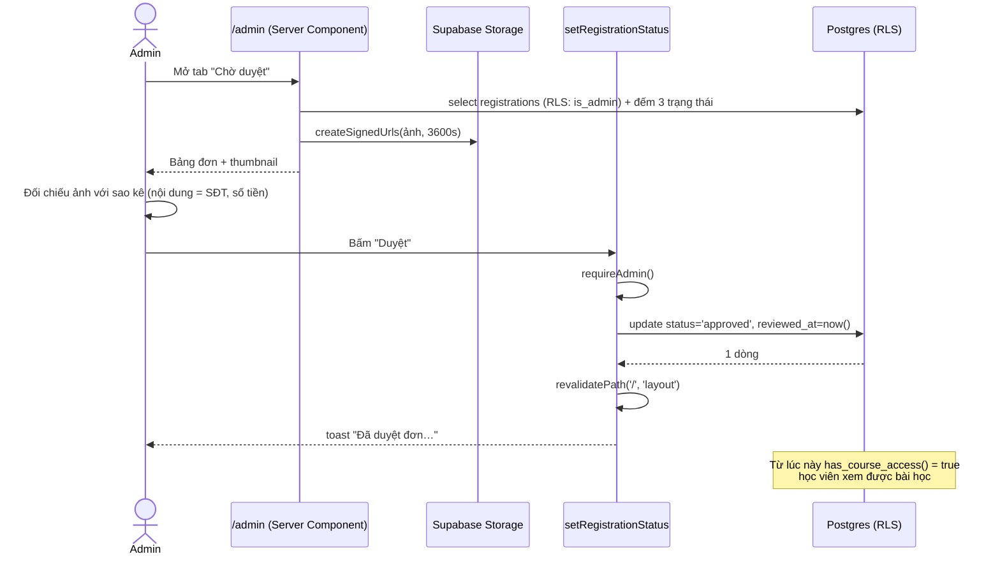
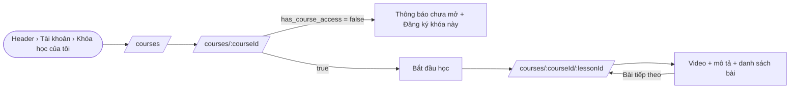
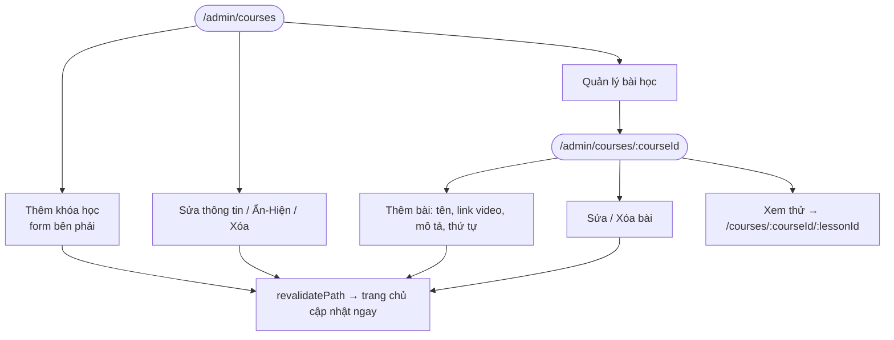

# Luồng người dùng (User Flows)

Các sơ đồ dùng Mermaid (xem được trên GitHub, VS Code với extension *Markdown Preview Mermaid Support*).

## UF-01 – Hành trình tổng thể của học viên



## UF-02 – Đăng ký khóa học (khách mới)

```mermaid
flowchart TD
  A([Khách mở / hoặc /register]) --> B{Bấm "Đăng ký" trên thẻ khóa?}
  B -- Có --> C[Cuộn tới #dang-ky, chọn sẵn khóa]
  B -- Không --> D[Chọn khóa ở Bước 3]
  C --> E[Bước 1: Quét QR<br/>số tiền + nội dung = SĐT]
  D --> E
  E --> F[Bước 2: Chụp ảnh giao dịch]
  F --> G[Bước 3: Điền họ tên, SĐT, email?, mật khẩu]
  G --> H[Chọn ảnh]
  H --> I{Là ảnh hợp lệ?}
  I -- Không --> H1[Báo lỗi định dạng] --> H
  I -- Có --> J[Nén ảnh trên trình duyệt]
  J --> K{≤ 5MB?}
  K -- Không --> H2[Báo ảnh quá lớn] --> H
  K -- Có --> L[Bấm Đăng ký → registerAction]
  L --> M{Server kiểm tra hợp lệ<br/>khóa published, SĐT/email chưa dùng}
  M -- Lỗi --> N[Hiện lỗi ở đầu Bước 3, cuộn lên] --> G
  M -- OK --> O[Tạo user đã xác nhận] --> P[Upload ảnh vào payment-proofs]
  P -- Lỗi --> R1[Xóa user] --> N
  P -- OK --> Q[Insert registrations pending]
  Q -- Lỗi --> R2[Xóa ảnh + xóa user] --> N
  Q -- OK --> S[Đăng nhập tự động, flash toast]
  S --> T([/courses?registered=1<br/>"Đang chờ xác nhận"])
```

## UF-03 – Đăng ký thêm khóa (đã đăng nhập)

```mermaid
flowchart TD
  A([Học viên mở box đăng ký]) --> B[Client đọc phiên + profile<br/>điền sẵn họ tên, SĐT]
  B --> C[Ẩn ô email & mật khẩu<br/>"Bạn đang đăng nhập với …"]
  C --> D[Chọn khóa, tải ảnh, gửi]
  D --> E{Đã có đơn pending/approved<br/>cho khóa này?}
  E -- pending --> F[Báo "đang chờ xác nhận"]
  E -- approved --> G[Báo "đã sở hữu khóa học"]
  E -- Không / chỉ rejected --> H[Upload ảnh → tạo đơn pending]
  H --> I([/courses?registered=1])
```

## UF-04 – Đăng nhập



## UF-05 – Quên mật khẩu



## UF-06 – Admin duyệt đơn



## UF-07 – Học bài



## UF-08 – Admin quản lý nội dung


