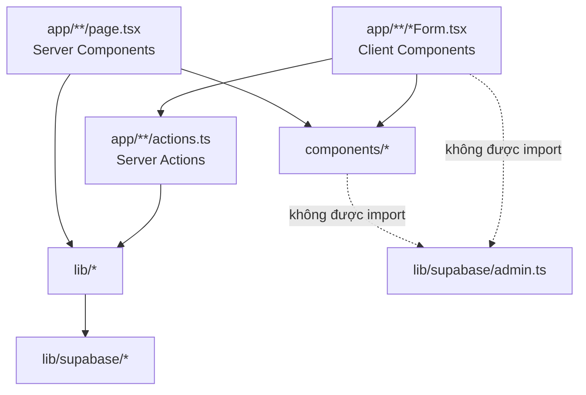
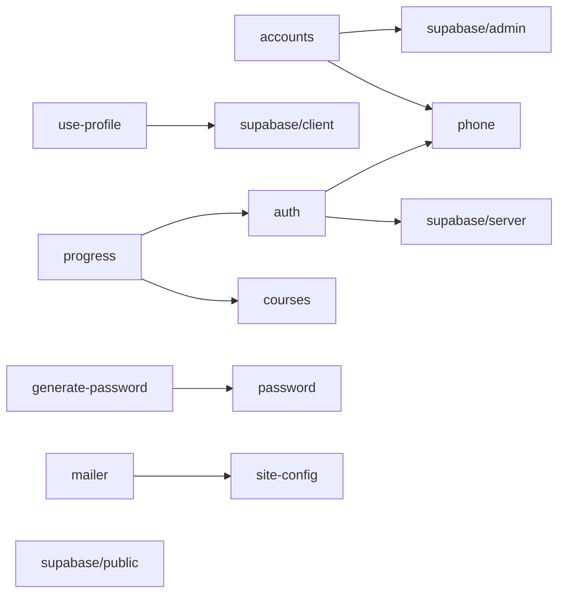

# Cấu trúc mã nguồn & trách nhiệm module

## 1. Cây thư mục

Cập nhật 27/09/2026 – sau Đợt 11 → 13 (v0.2). ✅ = đã có; mọi trang cần quyền gọi `requireUserPage` / `requireStaffPage` / `requireAdminPage` (ADR-016).

```text
course-platform/
├─ app/                              # Next.js App Router
│  ├─ layout.tsx                     # Khung chung: font, metadata/OG, header, footer, toast, progress, LoginReminders
│  ├─ page.tsx                       # Landing (ISR 300s): khóa theo 3 nhóm, box đăng ký #dang-ky
│  ├─ globals.css                    # Tailwind + class dùng chung (.btn, .input, .card, .alert-*, .badge…)
│  ├─ icon.svg, not-found.tsx
│  ├─ register/ {page, RegisterForm (client), actions}   # registerAction – chọn gói, ảnh chuyển khoản
│  ├─ login/ {page, actions}         # loginAction (email / SĐT, giới hạn tần suất)
│  ├─ forgot-password/ {page, ForgotPasswordForm, actions}
│  ├─ account/ {page, actions}       # updateProfileAction, changePasswordAction (tắt nhắc đổi mật khẩu), acceptConsentAction
│  ├─ chinh-sach-bao-mat/page.tsx    # Chính sách bảo mật (Đợt 8)
│  ├─ khoa-hoc/                      # Trang giới thiệu công khai (Đợt 8–9)
│  │  ├─ [courseId]/page.tsx         # Kiểu Udemy: đề cương theo buổi, chọn gói, premium CTA
│  │  ├─ PlanPicker.tsx, LeadDialog.tsx (client)
│  │  └─ actions.ts                  # createLeadAction
│  ├─ courses/                       # Khu vực bệnh nhân
│  │  ├─ page.tsx                    # Khóa học của tôi: tiến độ, hạn học, gia hạn, "Phiếu tham vấn của tôi"
│  │  ├─ actions.ts                  # completeLessonAction, uncompleteLessonAction (Đợt 10), submitConsultationAction (Đợt 12)
│  │  ├─ consultation/ {page, ConsultationForm (client)}  # Phiếu tham vấn (Đợt 12)
│  │  └─ [courseId]/ {page, [lessonId]/page}              # Trang khóa, trình học theo buổi (Đợt 10)
│  └─ admin/                         # Nhân viên + admin (layout gọi requireStaffPage)
│     ├─ layout.tsx, AdminNav.tsx, loading.tsx, error.tsx
│     ├─ actions.ts                  # Action quản trị dùng chung: đơn, lead, phiếu tham vấn, mẫu phiếu, phân quyền, khóa – gói – buổi – bài
│     ├─ page.tsx                    # Tổng quan / dashboard (Đợt 13); /admin?status= → registrations
│     ├─ registrations/page.tsx      # Đơn đăng ký (Đợt 7)
│     ├─ patients/                   # Bệnh nhân (Đợt 11, thay users/)
│     │  ├─ page.tsx                 # Danh sách + lọc (RPC admin_patients); tab Nhân viên & Admin (admin)
│     │  ├─ new/ {page, NewPatientForm (client)}           # Tạo bệnh nhân Zalo + cấp gói
│     │  ├─ [id]/ {page, ResetPassword (client)}           # Hồ sơ: gói, tiến độ, đơn, phiếu, nhật ký; cấp gói, sửa, cấp lại MK
│     │  ├─ actions.ts               # createPatientAction, grantPlanAction, updatePatientAction, resetPatientPasswordAction
│     │  ├─ GrantFields.tsx (client), RoleForm.tsx, data.ts (getPlanOptions)
│     ├─ users/page.tsx              # Đường dẫn cũ → /admin/patients
│     ├─ consultations/page.tsx      # Phiếu tham vấn (Đợt 12)
│     ├─ leads/page.tsx              # Khách quan tâm premium (Đợt 8)
│     ├─ settings/ {page → consultation, consultation/page}  # Mẫu phiếu tham vấn (chỉ admin)
│     └─ courses/                    # Chỉ admin
│        ├─ page.tsx                 # Khóa theo loại (Chương trình / Miễn phí / Premium), gói
│        ├─ fields.tsx, CoverInput.tsx, PlanTable.tsx
│        └─ [courseId]/page.tsx      # Buổi – bài (Đợt 10)
├─ components/                       # UI dùng chung (không chứa nghiệp vụ)
│  ├─ SiteHeader.tsx, SiteFooter.tsx, NavigationProgress.tsx, Toaster.tsx
│  ├─ ActionForm.tsx, SubmitButton.tsx, StatusBadge.tsx, icons.tsx
│  ├─ CourseCard.tsx, CourseCover.tsx, ProgramGrid.tsx             # Đợt 8
│  ├─ ProgressRing.tsx (Đợt 15, thay ProgressBar), SessionOutline.tsx # Đợt 10, 15
│  ├─ PasswordInput.tsx                                             # Đợt 15: ô mật khẩu có nút mắt
│  ├─ LoginReminders.tsx             # Đồng ý chính sách + nhắc đổi mật khẩu (thay ConsentReminder, Đợt 11)
│  ├─ OneTimeSecret.tsx              # Mật khẩu hiện một lần + tin nhắn Zalo (Đợt 11)
│  └─ StatCard.tsx                   # Thẻ chỉ số dashboard (Đợt 13)
├─ lib/                              # Nghiệp vụ & hạ tầng (không chứa JSX)
│  ├─ site-config.ts                 # Thương hiệu, liên hệ, ngân hàng, vietQrUrl, formatPrice
│  ├─ auth.ts                        # getCurrentUser (cache theo request), requireAdmin/Staff, requireUserPage/StaffPage/AdminPage
│  ├─ use-profile.ts                 # 'use client' – profile dùng chung cho header + hộp nhắc (cache 60s)
│  ├─ accounts.ts                    # findAccount, isPhoneTaken, isEmailTaken (service role)
│  ├─ phone.ts, password.ts          # SĐT / email nội bộ; độ dài mật khẩu (dùng cả ở trình duyệt)
│  ├─ generate-password.ts           # Mật khẩu hệ thống sinh (CSPRNG) – chỉ server
│  ├─ courses.ts                     # Loại khóa, nhóm bệnh, gói, buổi – khóa/mở, daysLeft
│  ├─ progress.ts                    # loadLearning, getCourseProgress, lessonLabel
│  ├─ consultation.ts                # Loại câu hỏi, trạng thái, định dạng câu trả lời phiếu tham vấn
│  ├─ format.ts                      # Ngày giờ VN, nhãn hình thức thanh toán / nguồn, displayName
│  ├─ image-type.ts, compress-image.ts, rate-limit.ts, turnstile.ts, consent.ts, mailer.ts, flash.ts, video.ts, action-result.ts
│  └─ supabase/ {server, client, public, admin}.ts
├─ middleware.ts                     # Nhẹ: đọc phiên từ cookie (getSession), chưa đăng nhập → /login (ADR-016)
├─ supabase/schema.sql               # Toàn bộ DB: bảng, index, hàm, trigger, RLS, storage (idempotent)
├─ scripts/ {env.mjs, create-admin.mjs, e2e.mjs, backup-storage.mjs}   # e2e ~2.300 dòng, 98 bước; backup-storage: tải ảnh Storage
├─ public/images/
├─ .github/workflows/ {ci.yml, keepalive.yml, backup.yml}   # CI; giữ Supabase Free hoạt động; sao lưu tuần (runbook §7.1)
├─ tailwind.config.ts, next.config.mjs (CSP, serverActions 6mb), vercel.json (vùng sin1)
└─ .env.local(.example)
```

## 2. Quy tắc phân tầng



| Tầng | Được phép | Không được phép |
| --- | --- | --- |
| `components/` | UI thuần, gọi `toast`, nhận action qua props | Truy vấn database, import `lib/supabase/admin` |
| `app/**/page.tsx` | Đọc dữ liệu bằng server client, render | Ghi dữ liệu (dùng action) |
| `app/**/actions.ts` | Validate, kiểm quyền, ghi dữ liệu, revalidate, redirect | Trả về dữ liệu nhạy cảm cho client |
| `lib/` | Hàm thuần/nghiệp vụ dùng lại | JSX |

## 3. Bảng tra nhanh "sửa gì ở đâu"

| Muốn thay đổi | File |
| --- | --- |
| Tên trung tâm, hotline, email, Zalo, thông tin bác sĩ, tài khoản ngân hàng | `lib/site-config.ts` |
| Nội dung trang chủ (pain points, lợi ích, FAQ) | `app/page.tsx` (mảng `painPoints`, `benefits`, `faqs`) |
| Màu sắc thương hiệu | `tailwind.config.ts` (`ocean`, `gold`) + `themeColor` trong `app/layout.tsx` + màu trong `lib/mailer.ts` |
| Kiểu nút, ô nhập, thẻ | `app/globals.css` |
| Quy tắc SĐT hợp lệ | `lib/phone.ts#normalizePhone` |
| Định dạng ảnh / dung lượng ảnh chuyển khoản | `RegisterForm.tsx` (`ACCEPTED`, `MAX_UPLOAD`) + `lib/image-type.ts` (`IMAGE_EXT`) + `register/actions.ts`, `admin/patients/actions.ts` (5MB) + bucket trong `schema.sql` + `next.config.mjs` |
| Thời hạn/số lần thử mã quên mật khẩu | `app/forgot-password/actions.ts` (hằng số đầu file) |
| Mẫu email | `lib/mailer.ts#resetCodeEmail` |
| Nguồn video hỗ trợ | `lib/video.ts` |
| Trang cần đăng nhập | `middleware.ts` (`config.matcher`, `PUBLIC_COURSE_PAGE`) + gọi `requireUserPage` trong trang |
| Trang chỉ nhân viên / chỉ admin | Gọi `requireStaffPage()` / `requireAdminPage()` đầu trang (bắt buộc cho trang mới) |
| Câu hỏi phiếu tham vấn mẫu | Giao diện `/admin/settings/consultation` (seed ban đầu trong `schema.sql`) |
| Chỉ số dashboard, doanh thu | Hàm `dashboard_stats()`, `revenue_report()` trong `schema.sql` + `app/admin/page.tsx` |
| Quy tắc mật khẩu tự sinh | `lib/generate-password.ts` |
| Bảng/cột/quyền database | `supabase/schema.sql` + tài liệu 04-database |
| Nhãn trạng thái (Chờ duyệt, Đã duyệt…) | `components/StatusBadge.tsx` |
| Menu header | `components/SiteHeader.tsx` (`navLinks`) |
| Menu quản trị (sidebar trái / tab ngang trên điện thoại) | `app/admin/AdminNav.tsx`, khung `app/admin/layout.tsx`, số đếm `app/admin/NavCount.tsx` |

## 4. Phụ thuộc giữa các module lib


