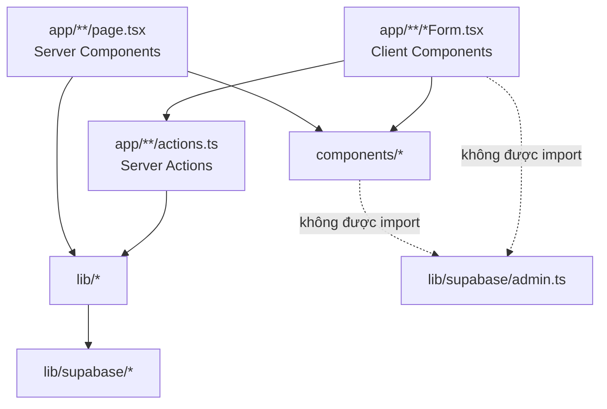
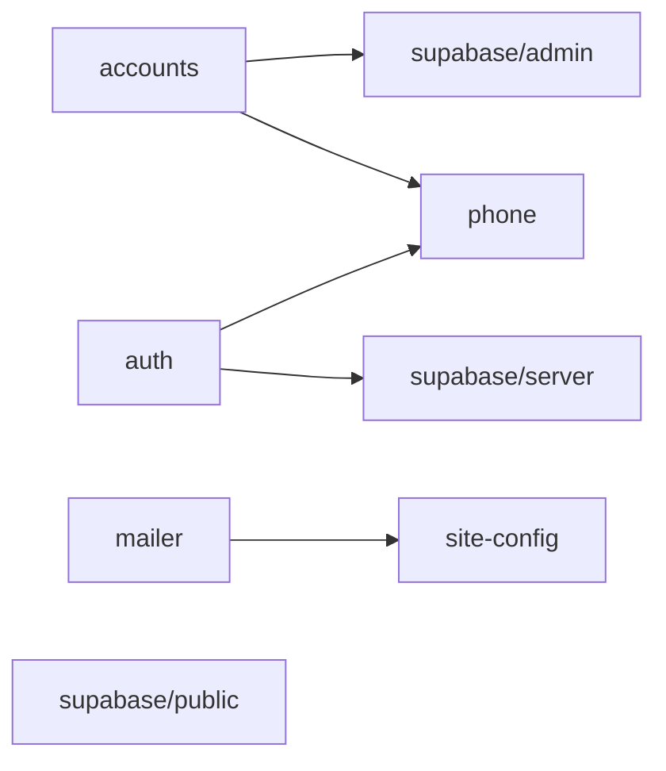

# Cấu trúc mã nguồn & trách nhiệm module

## 1. Cây thư mục

```text
course-platform/
├─ app/                              # Next.js App Router
│  ├─ layout.tsx                     # Khung chung: font, metadata/OG, header, footer, toast, progress
│  ├─ page.tsx                       # Landing page (ISR 300s) + box đăng ký #dang-ky
│  ├─ globals.css                    # Tailwind + class dùng chung (.btn, .input, .card, …)
│  ├─ icon.svg, not-found.tsx        # Favicon, trang 404
│  ├─ register/
│  │  ├─ page.tsx                    # Trang đăng ký riêng (ISR)
│  │  ├─ RegisterForm.tsx            # 'use client' – box 3 bước, QR, nén ảnh
│  │  └─ actions.ts                  # registerAction
│  ├─ login/ {page.tsx, actions.ts}  # loginAction
│  ├─ forgot-password/
│  │  ├─ page.tsx, ForgotPasswordForm.tsx
│  │  └─ actions.ts                  # forgotPasswordAction (request / verify)
│  ├─ account/ {page.tsx, actions.ts}# updateProfileAction, changePasswordAction
│  ├─ courses/
│  │  ├─ page.tsx                    # Khóa học của tôi
│  │  ├─ loading.tsx
│  │  └─ [courseId]/
│  │     ├─ page.tsx                 # Chi tiết khóa
│  │     └─ [lessonId]/page.tsx      # Xem bài học
│  └─ admin/
│     ├─ layout.tsx, AdminNav.tsx, loading.tsx, error.tsx
│     ├─ page.tsx                    # Chuyển tới registrations (Tổng quan ở Đợt 13)
│     ├─ registrations/page.tsx      # Bảng đơn đăng ký (nhân viên, admin)
│     ├─ actions.ts                  # Toàn bộ server action của admin
│     ├─ users/page.tsx              # Học viên
│     └─ courses/
│        ├─ page.tsx                 # Khóa học
│        ├─ fields.tsx               # CourseFields, LessonFields
│        └─ [courseId]/page.tsx      # Bài học của khóa
├─ components/                       # UI dùng chung (không chứa nghiệp vụ)
│  ├─ SiteHeader.tsx, SiteFooter.tsx
│  ├─ Toaster.tsx                    # toast() + đọc cookie flash
│  ├─ ActionForm.tsx                 # form → server action → toast
│  ├─ SubmitButton.tsx               # pending spinner + confirm()
│  ├─ NavigationProgress.tsx
│  ├─ StatusBadge.tsx
│  └─ icons.tsx                      # Icon SVG nội bộ
├─ lib/                              # Nghiệp vụ & hạ tầng (không chứa JSX)
│  ├─ site-config.ts                 # Thương hiệu, liên hệ, ngân hàng, vietQrUrl, formatPrice
│  ├─ auth.ts                        # getCurrentUser (role, isStaff), requireAdmin, requireStaff
│  ├─ accounts.ts                    # findAccount, isPhoneTaken, isEmailTaken (service role)
│  ├─ phone.ts                       # normalizePhone, phoneToAuthEmail, realEmail, isValidEmail
│  ├─ mailer.ts                      # sendMail, resetCodeEmail
│  ├─ flash.ts                       # setFlash (cookie)
│  ├─ action-result.ts               # type ActionResult
│  ├─ video.ts                       # getVideoEmbed
│  └─ supabase/ {server, client, public, admin}.ts
├─ middleware.ts                     # Bảo vệ /courses, /account, /admin (staff/admin; khóa học chỉ admin)
├─ supabase/schema.sql               # Toàn bộ DB: bảng, index, hàm, trigger, RLS, storage
├─ scripts/
│  ├─ env.mjs                        # Đọc .env.local cho script
│  ├─ create-admin.mjs               # Tạo / nâng quyền admin
│  └─ e2e.mjs                        # Kiểm thử end-to-end (~680 dòng)
├─ public/images/                    # Ảnh bác sĩ, ảnh trung tâm
├─ tailwind.config.ts                # Design token: ocean, gold, font, animation
├─ next.config.mjs                   # serverActions.bodySizeLimit = 6mb
└─ .env.local(.example)              # Biến môi trường
```

### 1.1. File dự kiến thêm / đổi ở phiên bản 0.2 (chưa triển khai)

```text
app/
├─ khoa-hoc/[courseId]/page.tsx       # ✅ Giới thiệu khóa kiểu Udemy (ISR)       – Đợt 8
├─ khoa-hoc/actions.ts                # ✅ createLeadAction                        – Đợt 8
├─ khoa-hoc/LeadDialog.tsx            # ✅ 'use client' hộp lead premium + mở Zalo – Đợt 8
├─ chinh-sach-bao-mat/page.tsx        # ✅ Chính sách bảo mật                      – Đợt 8
├─ admin/courses/CoverInput.tsx       # ✅ 'use client' chọn / nén ảnh bìa         – Đợt 8
├─ admin/leads/page.tsx               # ✅ Khách quan tâm (setLeadStatus trong admin/actions.ts) – Đợt 8
├─ admin/courses/PlanTable.tsx        # ✅ Bảng gói theo thời hạn (createPlan / updatePlan / deletePlan) – Đợt 9
├─ khoa-hoc/PlanPicker.tsx            # ✅ 'use client' chọn gói ở trang giới thiệu – Đợt 9
├─ courses/
│  ├─ actions.ts                      # ✅ completeLessonAction, uncompleteLessonAction (Đợt 10); submitConsultationAction – Đợt 12
│  ├─ consultation/page.tsx           # Phiếu tham vấn                             – Đợt 12
│  └─ [courseId]/[lessonId]/
│     └─ page.tsx                     # ✅ Trình học (buổi, checklist; tick bằng form server action, không cần client component) – Đợt 10
├─ admin/
│  ├─ page.tsx                        # Tổng quan (dashboard)                      – Đợt 13
│  ├─ registrations/page.tsx          # ✅ Bảng đơn (chuyển từ admin/page.tsx)     – Đợt 7
│  ├─ patients/{page, new/page, [id]/page, actions}.tsx|ts # thay users/     – Đợt 11
│  ├─ consultations/{page.tsx, actions.ts}                                         – Đợt 12
│  ├─ leads/{page.tsx, actions.ts}                                                 – Đợt 8
│  ├─ courses/[courseId]/page.tsx     # Gói + buổi – bài                           – Đợt 9, 10
│  └─ settings/consultation/page.tsx  # Mẫu phiếu tham vấn                         – Đợt 12
components/
├─ ✅ CourseCover.tsx, CourseCard.tsx, ProgramGrid.tsx (lọc nhóm bệnh), ConsentReminder.tsx – Đợt 8
├─ ✅ ProgressBar.tsx, SessionOutline.tsx (Đợt 10) · OneTimeSecret.tsx, StatCard.tsx, LoginReminders.tsx
lib/
├─ auth.ts                            # + role, requireStaff
├─ password.ts                        # + generatePassword (CSPRNG, bảng chữ dễ đọc)
├─ ✅ courses.ts                      # Loại khóa, nhóm bệnh, nhãn (Đợt 8); PLAN_MONTHS, planLabel, sortPlans, daysLeft, formatDate (Đợt 9)
├─ ✅ consent.ts, compress-image.ts    # Phiên bản chính sách; nén ảnh dùng chung (Đợt 8)
├─ ✅ supabase/public.ts               # getPublishedCourses, getRegistrableCourses, getPublicCourse, getCourseOutline
└─ ✅ progress.ts                     # loadLearning (đề cương + buổi khóa/mở + tiến độ), getCourseProgress, lessonLabel – Đợt 10
```

## 2. Quy tắc phân tầng



| Tầng | Được phép | Không được phép |
| --- | --- | --- |
| `components/` | UI thuần, gọi `toast`, nhận action qua props | Truy vấn database, import `lib/supabase/admin` |
| `app/**/page.tsx` | Đọc dữ liệu bằng server client, render | Ghi dữ liệu (dùng action) |
| `app/**/actions.ts` | Validate, kiểm quyền, ghi dữ liệu, revalidate, redirect | Trả về dữ liệu nhạy cảm cho client |
| `lib/` | Hàm thuần/nghiệp vụ dùng lại | JSX |

## 3. Bảng tra nhanh "sửa gì ở đâu"

| Muốn thay đổi | File |
| --- | --- |
| Tên trung tâm, hotline, email, Zalo, thông tin bác sĩ, tài khoản ngân hàng | `lib/site-config.ts` |
| Nội dung trang chủ (pain points, lợi ích, FAQ) | `app/page.tsx` (mảng `painPoints`, `benefits`, `faqs`) |
| Màu sắc thương hiệu | `tailwind.config.ts` (`ocean`, `gold`) + `themeColor` trong `app/layout.tsx` + màu trong `lib/mailer.ts` |
| Kiểu nút, ô nhập, thẻ | `app/globals.css` |
| Quy tắc SĐT hợp lệ | `lib/phone.ts#normalizePhone` |
| Định dạng ảnh / dung lượng ảnh chuyển khoản | `RegisterForm.tsx` (`ACCEPTED`, `MAX_UPLOAD`) + `register/actions.ts` (`IMAGE_EXT`, `MAX_FILE_SIZE`) + bucket trong `schema.sql` + `next.config.mjs` |
| Thời hạn/số lần thử mã quên mật khẩu | `app/forgot-password/actions.ts` (hằng số đầu file) |
| Mẫu email | `lib/mailer.ts#resetCodeEmail` |
| Nguồn video hỗ trợ | `lib/video.ts` |
| Trang cần đăng nhập | `middleware.ts` (`config.matcher`) |
| Bảng/cột/quyền database | `supabase/schema.sql` + tài liệu 04-database |
| Nhãn trạng thái (Chờ duyệt, Đã duyệt…) | `components/StatusBadge.tsx` |
| Menu header | `components/SiteHeader.tsx` (`navLinks`) |
| Tab admin | `app/admin/AdminNav.tsx` |

## 4. Phụ thuộc giữa các module lib


