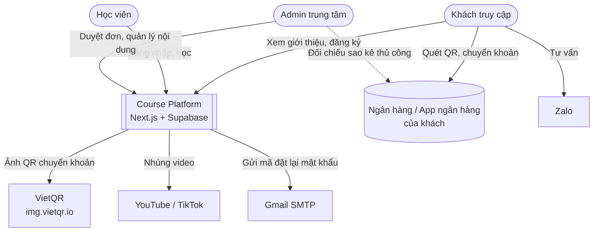
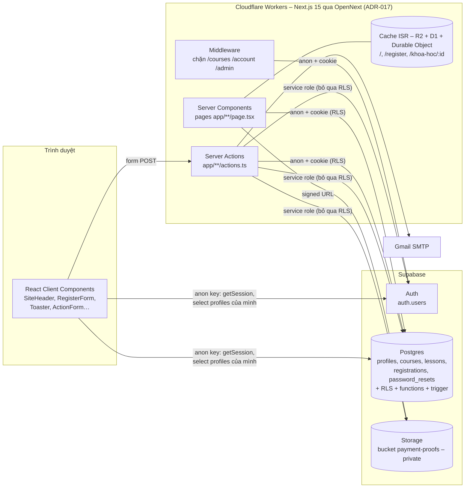
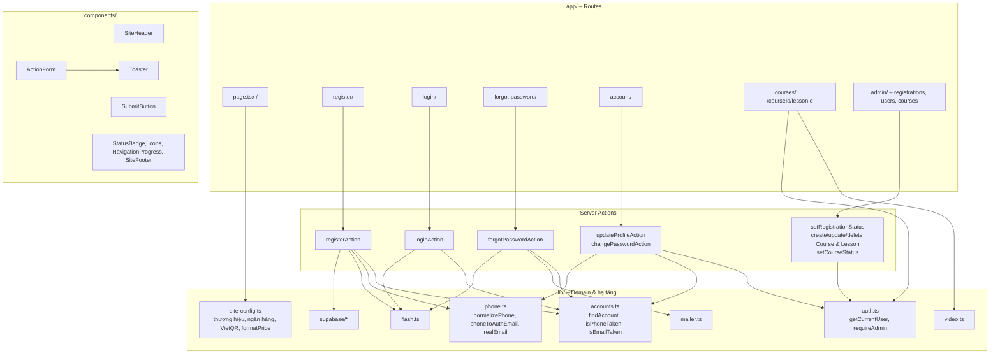
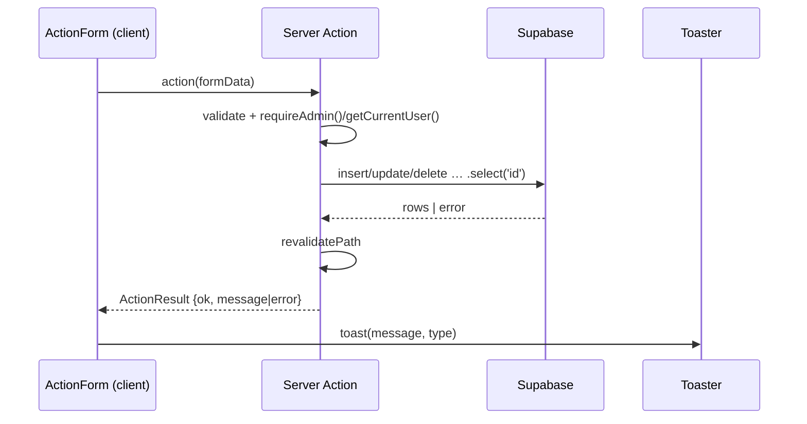
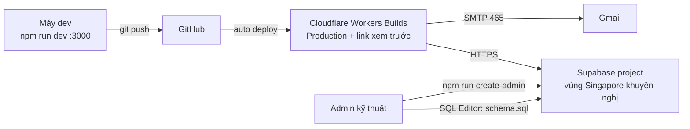

# Kiến trúc hệ thống

Tài liệu dùng mô hình **C4** (Context → Container → Component) và bổ sung các góc nhìn runtime,
render, triển khai.

## 1. Nguyên tắc kiến trúc

| # | Nguyên tắc | Hệ quả trong code |
| --- | --- | --- |
| A1 | **Database là lớp phân quyền cuối cùng** | Mọi bảng bật RLS; UI/middleware chỉ là lớp tiện dụng, không phải lớp bảo mật duy nhất |
| A2 | **Server-first** | Đọc dữ liệu trong Server Component, ghi dữ liệu bằng Server Action; client component chỉ cho tương tác |
| A3 | **Bí mật chỉ ở server** | `SUPABASE_SERVICE_ROLE_KEY`, SMTP chỉ dùng trong `'use server'` / script |
| A4 | **Trang công khai tĩnh** | Trang chủ, `/register` dùng ISR + client anon không cookie; header đọc phiên ở client |
| A5 | **Không tự xây hạ tầng khi có dịch vụ miễn phí** | Video YouTube/TikTok, QR VietQR, Auth/Storage của Supabase |
| A6 | **Đơn giản, ít phụ thuộc** | Không dùng thư viện UI/form/state; icon SVG tự viết; toast tự viết |

## 2. C4 – Level 1: System Context



## 3. C4 – Level 2: Container



### Bốn loại Supabase client

| Client | File | Khóa | Cookie phiên | RLS | Dùng ở đâu |
| --- | --- | --- | --- | --- | --- |
| Server | `lib/supabase/server.ts` | anon | Đọc/ghi | ✅ Có | Server Component, Server Action (quyền theo người dùng) |
| Browser | `lib/supabase/client.ts` | anon | Đọc (document.cookie) | ✅ Có | Header, RegisterForm (đọc phiên/profile), đăng xuất |
| Public | `lib/supabase/public.ts` | anon | ❌ Không | ✅ Có (vai trò anon) | Trang tĩnh ISR (`getPublishedCourses`) |
| Admin | `lib/supabase/admin.ts` | **service role** | ❌ Không | ❌ **Bỏ qua** | Chỉ trong Server Action / script: tạo user, upload ảnh, tạo đơn, tra tài khoản, reset mật khẩu |

> Quy tắc: **không bao giờ** import `lib/supabase/admin.ts` vào file có `'use client'`.
> Thao tác admin nội dung (khóa học, bài học, duyệt đơn) cố ý dùng **server client** (chịu RLS)
> để database kiểm tra quyền lần nữa, không dùng service role.

## 4. C4 – Level 3: Component (ứng dụng Next.js)



## 5. Chiến lược render

| Route | Kiểu | Lý do |
| --- | --- | --- |
| `/` | **ISR** `revalidate = 300` + `revalidatePath` khi admin sửa | Trang nhiều traffic, dữ liệu ít đổi. Không đọc cookie để giữ được tĩnh |
| `/register` | ISR 300 | Như trên |
| `/login`, `/forgot-password` | Động (đọc `searchParams`) | Hiển thị lỗi từ query |
| `/courses/**`, `/account` | Động (cookie) | Dữ liệu theo người dùng |
| `/admin/**` | Động (cookie) | Dữ liệu quản trị, luôn mới |
| Header | Client component đọc phiên ở trình duyệt, tải lại mỗi khi `pathname` đổi | Giúp các trang công khai vẫn tĩnh |

Sau **mọi** thao tác ghi của admin: `revalidatePath('/', 'layout')` → xóa cache toàn site.

## 6. Luồng xử lý chuẩn

### 6.1. Ghi dữ liệu không redirect (admin, tài khoản)



### 6.2. Ghi dữ liệu có redirect (đăng ký, đăng nhập, đặt lại mật khẩu)

Server Action → `setFlash(message)` (cookie `flash`, 60s) → `redirect(url)` → trang mới render →
`Toaster` đọc cookie khi `pathname` đổi → hiện toast → xóa cookie.

### 6.3. Form nhiều trạng thái (đăng ký, quên mật khẩu)

Dùng `useFormState(action, initialState)`; action nhận `prevState` và trả state mới
(`RegisterState`, `ForgotState`) để hiện lỗi/chuyển giai đoạn mà không mất dữ liệu đã nhập.

## 7. Kiểm soát truy cập nhiều lớp (defense in depth)

```mermaid
flowchart LR
  R[Request] --> L1{Middleware<br/>có phiên trong cookie?<br/>getSession – không gọi mạng}
  L1 -- không --> X1[Redirect /login]
  L1 -- ok --> L1b{Trang: requireUserPage /<br/>requireStaffPage / requireAdminPage<br/>getUser đã xác thực, cache theo request}
  L1b -- không --> X1b[Redirect /login, /courses hoặc /admin]
  L1b -- ok --> L2{Server Action<br/>requireAdmin / requireStaff / getCurrentUser}
  L2 -- không --> X2[ActionResult lỗi]
  L2 -- ok --> L3{Postgres RLS<br/>is_admin / has_course_access<br/>auth.uid() = user_id}
  L3 -- không --> X3[0 dòng / lỗi]
  %% ADR-016: vai trò kiểm tra ở trang (L1b), middleware chỉ kiểm tra đăng nhập
  L3 -- ok --> OK[Dữ liệu]
```

Chi tiết: [07-security/security-design.md](../07-security/security-design.md).

## 8. Triển khai (Deployment view)



- Chỉ có **một** môi trường Supabase trong cấu hình mặc định. Khuyến nghị tách project `staging`
  và `production` (xem [deployment-runbook.md](../09-operations/deployment-runbook.md)).
- E2E chạy trên server local cổng 3123 nhưng dùng **Supabase thật** trong `.env.local`
  (dữ liệu test có tiền tố `[E2E]`/`e2e-` và được xóa sau khi chạy).

## 9. Điểm mở rộng kiến trúc

| Nhu cầu | Điểm cắm vào |
| --- | --- |
| Thông báo khi duyệt đơn | Trong `setRegistrationStatus` sau khi update thành công, hoặc Database Webhook / Edge Function của Supabase |
| Thanh toán tự động | Route Handler mới `app/api/webhooks/payment/route.ts` dùng service role để chuyển đơn sang `approved` |
| Video riêng tư | Thay `lib/video.ts` bằng nhà cung cấp có signed URL (Bunny Stream, Cloudflare Stream, Mux) |
| Đa vai trò | Mở rộng `check (role in …)` và thay `is_admin()` bằng `has_role(text)` |
| API cho app di động | Dùng trực tiếp Supabase (RLS đã sẵn), bổ sung Route Handler cho các nghiệp vụ cần service role |

## 10. Thay đổi kiến trúc phiên bản 0.2 (chốt 27/09/2026, triển khai theo Đợt 7 → 13)

| Hạng mục | Thay đổi | ADR |
| --- | --- | --- |
| Phân quyền | ✅ Đợt 7: `is_staff()` bên cạnh `is_admin()`; `requireStaff()`. ✅ Đợt 11: vai trò kiểm tra ở trang (`requireStaffPage` / `requireAdminPage`), middleware nhẹ chỉ đọc cookie | ADR-011, ADR-016 |
| Nội dung trả phí | ✅ Đợt 10: đề cương đọc công khai qua RPC `course_outline` (không có link); `lessons` (kèm `video_url`) đọc theo RLS `is_staff() or can_view_lesson(id)` – thay cho RPC `get_lesson_video` dự kiến | ADR-013 |
| Luật học tập | ✅ Đợt 9–10: hạn học, số buổi đã mua, mở buổi tuần tự đều tính trong database (hàm SQL), trang chỉ hiển thị | ADR-012, ADR-013 |
| Ghi tiến độ | ✅ Đợt 10: server action `completeLessonAction` / `uncompleteLessonAction` dùng **server client** (RLS kiểm tra) → không cần service role | ADR-013 |
| Tạo tài khoản bởi nhân viên | ✅ Đợt 11: service role tạo user (như ADR-006); đơn cấp gói insert bằng server client của nhân viên (policy `registrations_staff_insert` + trigger) để ghi đúng người | ADR-014 |
| Trang công khai | `/khoa-hoc/[id]` ISR như trang chủ (`revalidatePath` khi admin sửa khóa/gói/buổi); `/courses/[id]/**` render động, công khai với khóa free | ADR-008 |
| Storage | Thêm bucket **public** `course-covers` (ảnh bìa); `payment-proofs` cho staff đọc | — |
| Dashboard | ✅ Đợt 13: hàm SQL `dashboard_stats()` (1 lần gọi cho mọi thẻ + danh sách), `revenue_report()` (chỉ admin); hàm nội bộ `_patient_courses()` dùng chung với danh sách / hồ sơ bệnh nhân; không thêm dịch vụ ngoài | — |
| Phiếu tham vấn | ✅ Đợt 12: ghi bằng service role sau khi kiểm tra; bệnh nhân đọc qua `my_consultations()` (ẩn ghi chú nội bộ) | ADR-015 |
| Hiệu năng xác thực | ✅ `getCurrentUser()` bọc `React.cache` (1 lần xác thực / request); header + hộp nhắc dùng chung profile phía trình duyệt (`lib/use-profile.ts`, cache 60s) | ADR-016 |
| Zalo | Chỉ dùng link `zalo.me` (mở chat); không tích hợp API Zalo OA ở v0.2 | ADR-015 |
