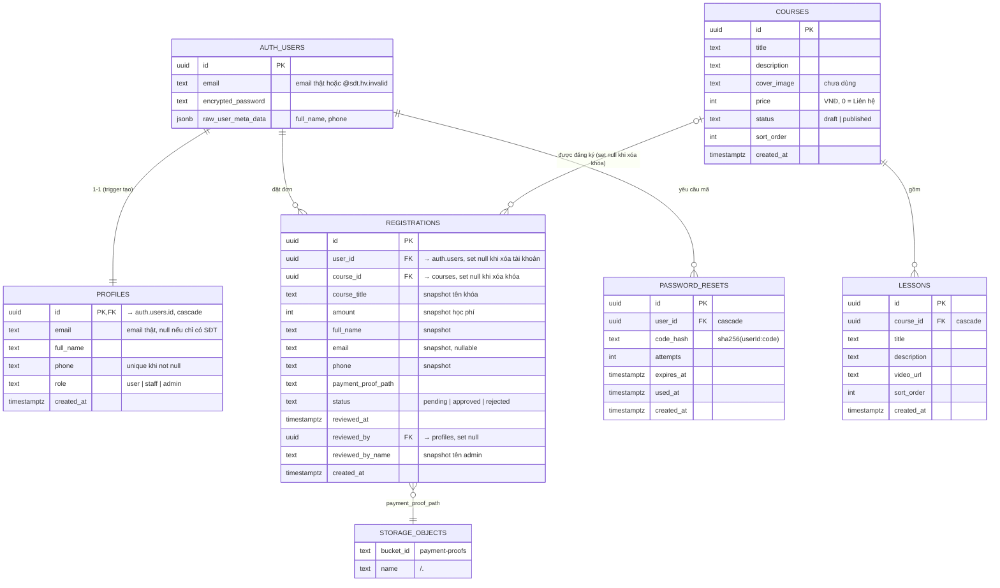
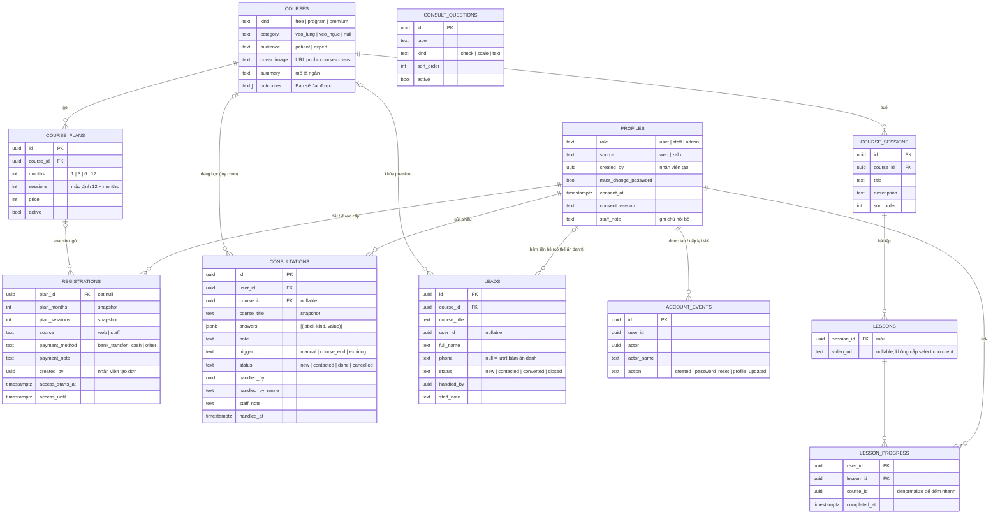

# Thiết kế cơ sở dữ liệu

Nguồn sự thật: `supabase/schema.sql` (PostgreSQL trên Supabase). Tài liệu này giải thích ý nghĩa và
ràng buộc; khi hai nơi lệch nhau, **sửa cả hai**.

## 1. Sơ đồ quan hệ (ERD)

## 2. Từ điển dữ liệu

### 2.1. `public.profiles`
Thông tin hồ sơ, 1-1 với `auth.users`. Tạo tự động bởi trigger.

| Cột | Kiểu | Null | Mặc định | Ràng buộc / ý nghĩa |
| --- | --- | --- | --- | --- |
| `id` | uuid | ✗ | — | PK, FK `auth.users(id)` **on delete cascade** |
| `email` | text | ✓ | — | Email thật (chữ thường). `null` với tài khoản chỉ có SĐT. **Không** unique ở DB (unique do Auth) |
| `full_name` | text | ✓ | — | Họ tên |
| `phone` | text | ✓ | — | SĐT chuẩn hóa `0xxxxxxxxx`. Unique index một phần `profiles_phone_key … where phone is not null` |
| `role` | text | ✗ | `'user'` | Constraint `profiles_role_check`: `role in ('user','staff','admin')` (staff từ Đợt 7 – ADR-011) |
| `consent_at` | timestamptz | ✓ | — | Thời điểm đồng ý Chính sách bảo mật (Đợt 8) |
| `consent_version` | text | ✓ | — | Phiên bản chính sách đã đồng ý (`lib/consent.ts`) |
| `source` | text | ✗ | `'web'` | (Đợt 11) `web` = khách tự đăng ký · `zalo` = nhân viên tạo (constraint `profiles_source_check`) |
| `created_by` | uuid | ✓ | — | (Đợt 11) Nhân viên tạo tài khoản, FK `profiles` on delete set null |
| `must_change_password` | boolean | ✗ | `false` | (Đợt 11) Mật khẩu do nhân viên cấp → nhắc đổi sau đăng nhập; tắt khi bệnh nhân đổi mật khẩu |
| `created_at` | timestamptz | ✗ | `now()` | |

> Ghi chú nội bộ về bệnh nhân **không** nằm ở `profiles` (bệnh nhân đọc được dòng của mình) mà ở `patient_notes` (§2.10).

### 2.2. `public.courses`

| Cột | Kiểu | Null | Mặc định | Ý nghĩa |
| --- | --- | --- | --- | --- |
| `id` | uuid | ✗ | `gen_random_uuid()` | PK |
| `title` | text | ✗ | — | Tên khóa học |
| `description` | text | ✓ | — | Mô tả ngắn (hiển thị tối đa 3 dòng ở thẻ) |
| `cover_image` | text | ✓ | — | URL công khai ảnh bìa trong bucket `course-covers` (Đợt 8) |
| `kind` | text | ✗ | `'program'` | `courses_kind_check`: `free` / `program` / `premium` (ADR-012) |
| `category` | text | ✓ | — | `courses_category_check`: `veo_lung` / `veo_nguc` |
| `audience` | text | ✗ | `'patient'` | `patient` / `expert` (chưa có UI) |
| `summary` | text | ✓ | — | Mô tả ngắn trên thẻ khóa (≤ 300 ký tự, kiểm tra ở server) |
| `outcomes` | text[] | ✗ | `'{}'` | "Bạn sẽ đạt được" (≤ 12 ý × 200 ký tự) |
| `price` | int | ✗ | `0` | Học phí VNĐ. `constraint courses_price_nonnegative check (price >= 0)`; server giới hạn ≤ 1 tỷ |
| `status` | text | ✗ | `'published'` | `check (status in ('draft','published'))` |
| `sort_order` | int | ✗ | `0` | Thứ tự hiển thị tăng dần |
| `created_at` | timestamptz | ✗ | `now()` | |

### 2.3. `public.lessons`

| Cột | Kiểu | Null | Mặc định | Ý nghĩa |
| --- | --- | --- | --- | --- |
| `id` | uuid | ✗ | `gen_random_uuid()` | PK |
| `course_id` | uuid | ✗ | — | FK `courses(id)` **on delete cascade** |
| `title` | text | ✗ | — | |
| `description` | text | ✓ | — | Hiển thị giữ xuống dòng (`whitespace-pre-line`) |
| `video_url` | text | ✓ (Đợt 10) | — | Link YouTube/TikTok gốc (xem ADR-005); `null` = bài chưa có video (khung buổi mới tạo) |
| `session_id` | uuid | ✓ | — | Buổi của bài, FK `course_sessions` on delete cascade (Đợt 10; chạy schema gom bài cũ vào "Buổi 1") |
| `sort_order` | int | ✗ | `0` | |
| `created_at` | timestamptz | ✗ | `now()` | |

Index: `lessons_course_id_idx (course_id, sort_order)`, `lessons_session_idx (session_id, sort_order)`.

### 2.3b. `public.course_sessions` (buổi tập – Đợt 10)

| Cột | Kiểu | Null | Mặc định | Ý nghĩa |
| --- | --- | --- | --- | --- |
| `id` | uuid | ✗ | `gen_random_uuid()` | PK |
| `course_id` | uuid | ✗ | — | FK `courses` on delete cascade |
| `title` | text | ✗ | — | VD "Buổi 1" |
| `description` | text | ✓ | — | |
| `sort_order` | int | ✗ | `0` | Thứ tự buổi (↑ ↓ đánh lại 1…n) |
| `created_at` | timestamptz | ✗ | `now()` | |

### 2.3c. `public.lesson_progress` (checklist / tiến độ – Đợt 10)

| Cột | Kiểu | Null | Mặc định | Ý nghĩa |
| --- | --- | --- | --- | --- |
| `user_id` | uuid | ✗ | — | PK (cùng `lesson_id`), FK `auth.users` on delete cascade |
| `lesson_id` | uuid | ✗ | — | FK `lessons` on delete cascade |
| `course_id` | uuid | ✗ | — | Trigger `lesson_progress_fill` điền từ bài học; index `(user_id, course_id)` |
| `completed_at` | timestamptz | ✗ | `now()` | Trigger đặt lại `now()` |

### 2.4. `public.registrations`

| Cột | Kiểu | Null | Mặc định | Ý nghĩa |
| --- | --- | --- | --- | --- |
| `id` | uuid | ✗ | `gen_random_uuid()` | PK |
| `user_id` | uuid | ✓ | — | FK `auth.users(id)` **on delete set null** – `null` nghĩa là tài khoản đã bị xóa, đơn vẫn giữ làm lịch sử (RK-03) |
| `course_id` | uuid | ✓ | — | FK `courses(id)` **on delete set null** – `null` nghĩa là khóa đã bị xóa, đơn vẫn giữ làm lịch sử |
| `course_title` | text | ✓ | — | Snapshot tên khóa lúc đăng ký (đơn cũ được điền tự động khi chạy schema) |
| `amount` | int | ✓ | — | Snapshot học phí lúc đăng ký (VNĐ) – dùng cho lịch sử thanh toán / báo cáo doanh thu |
| `full_name` | text | ✗ | — | Snapshot tại thời điểm đăng ký |
| `email` | text | ✓ | — | Snapshot email thật (đã bỏ `not null`) |
| `phone` | text | ✗ | — | Snapshot SĐT |
| `payment_proof_path` | text | ✓ (Đợt 9) | — | Đường dẫn trong bucket `payment-proofs`. `registrations_proof_check`: bắt buộc khi `source = 'web'` |
| `status` | text | ✗ | `'pending'` | `check (status in ('pending','approved','rejected'))` |
| `reviewed_at` | timestamptz | ✓ | — | Thời điểm admin xử lý gần nhất (trigger ghi) |
| `reviewed_by` | uuid | ✓ | — | Admin xử lý gần nhất, FK `profiles(id)` **on delete set null** (trigger ghi `auth.uid()`) |
| `reviewed_by_name` | text | ✓ | — | Snapshot tên admin lúc xử lý (`full_name` → `email` → `phone`), hiển thị ở cột "Người xử lý" |
| `review_note` | text | ✓ | — | Lý do từ chối / thu hồi (học viên thấy). Trigger xóa khi về pending; không đổi được nếu `status` không đổi |
| `plan_id` | uuid | ✓ | — | Gói lúc đăng ký, FK `course_plans` on delete set null (Đợt 9) |
| `plan_months`, `plan_sessions` | int | ✓ | — | Snapshot gói. `null` = đơn cũ v0.1 (không thời hạn, mở mọi buổi) |
| `source` | text | ✗ | `'web'` | `web` (khách tự đăng ký) / `staff` (nhân viên cấp – Đợt 11) |
| `payment_method` | text | ✗ | `'bank_transfer'` | `bank_transfer` / `cash` / `other` |
| `payment_note` | text | ✓ | — | Ghi chú thanh toán (nhân viên – Đợt 11) |
| `created_by` | uuid | ✓ | — | Nhân viên tạo đơn (Đợt 11), FK `profiles` on delete set null |
| `access_starts_at`, `access_until` | timestamptz | ✓ | — | Hạn học do trigger tính khi duyệt (BR-80); xóa khi rời trạng thái duyệt |
| `created_at` | timestamptz | ✗ | `now()` | |

Index: `registrations_user_idx (user_id, course_id, status)` – phục vụ `has_course_access` và kiểm tra trùng;
`registrations_status_idx (status, created_at)` – phục vụ tab admin;
~~`registrations_active_key`~~ (bỏ ở Đợt 9) → `registrations_pending_key` **unique** `(user_id, course_id) where status = 'pending'` – chặn 2 đơn chờ duyệt kể cả khi gửi đồng thời (BR-84, RK-07); cho phép nhiều đơn đã duyệt (gia hạn). `registrations_access_idx (user_id, course_id, status, access_until)` phục vụ `has_course_access`.
Nếu dữ liệu cũ đang có đơn trùng, `schema.sql` bỏ qua bước tạo index và in cảnh báo; xử lý đơn trùng rồi chạy lại.

### 2.4b. `public.course_plans` (gói theo thời hạn – Đợt 9)

| Cột | Kiểu | Null | Mặc định | Ý nghĩa |
| --- | --- | --- | --- | --- |
| `id` | uuid | ✗ | `gen_random_uuid()` | PK |
| `course_id` | uuid | ✗ | — | FK `courses` on delete cascade |
| `months` | int | ✗ | — | `check in (1, 3, 6, 12)`; unique `(course_id, months)` |
| `sessions` | int | ✗ | — | Số buổi được mở, `check between 1 and 500` (mặc định 12 × tháng ở server) |
| `price` | int | ✗ | — | VNĐ, `check between 0 and 1000000000` |
| `active` | boolean | ✗ | `true` | Đang bán |
| `created_at` | timestamptz | ✗ | `now()` | |

Chạy schema: chương trình cũ có học phí > 0 mà chưa có gói → tự tạo gói 1 tháng (12 buổi) theo học phí cũ.

### 2.5. `public.password_resets`

| Cột | Kiểu | Null | Mặc định | Ý nghĩa |
| --- | --- | --- | --- | --- |
| `id` | uuid | ✗ | `gen_random_uuid()` | PK |
| `user_id` | uuid | ✗ | — | FK `auth.users(id)` cascade |
| `code_hash` | text | ✗ | — | `sha256(userId:code)` dạng hex |
| `attempts` | int | ✗ | `0` | Số lần nhập sai |
| `expires_at` | timestamptz | ✗ | — | `created_at + 10 phút` |
| `used_at` | timestamptz | ✓ | — | Đã dùng / bị vô hiệu |
| `created_at` | timestamptz | ✗ | `now()` | Dùng để giới hạn gửi lại 60 giây |

Index: `password_resets_user_idx (user_id, created_at desc)`.

### 2.6. `public.registration_events` (lịch sử xử lý đơn)

| Cột | Kiểu | Null | Mặc định | Ý nghĩa |
| --- | --- | --- | --- | --- |
| `id` | uuid | ✗ | `gen_random_uuid()` | PK |
| `registration_id` | uuid | ✗ | — | FK `registrations(id)` on delete cascade |
| `actor` | uuid | ✓ | — | Admin thực hiện, FK `profiles(id)` on delete set null; null = service role / hệ thống |
| `actor_name` | text | ✓ | — | Snapshot tên admin |
| `from_status`, `to_status` | text | ✗ | — | Trạng thái trước → sau |
| `note` | text | ✓ | — | Lý do (nếu có) |
| `created_at` | timestamptz | ✗ | `now()` | |

Index: `registration_events_registration_idx (registration_id, created_at)`. Chỉ trigger `registrations_stamp_review` ghi.

### 2.7. `public.role_events` (nhật ký phân quyền)

| Cột | Kiểu | Null | Mặc định | Ý nghĩa |
| --- | --- | --- | --- | --- |
| `id` | uuid | ✗ | `gen_random_uuid()` | PK |
| `user_id` | uuid | ✓ | — | Tài khoản được đổi quyền, FK `profiles(id)` on delete set null |
| `user_name` | text | ✓ | — | Snapshot tên tài khoản |
| `actor`, `actor_name` | uuid, text | ✓ | — | Admin thực hiện (null = script / service role) |
| `from_role`, `to_role` | text | ✗ | — | `user` ↔ `admin` |
| `created_at` | timestamptz | ✗ | `now()` | |

Index: `role_events_user_idx (user_id, created_at desc)`. Chỉ trigger `profiles_guard_role` ghi.

### 2.7b. `public.leads` (khách quan tâm khóa premium – Đợt 8)

| Cột | Kiểu | Null | Mặc định | Ý nghĩa |
| --- | --- | --- | --- | --- |
| `id` | uuid | ✗ | `gen_random_uuid()` | PK |
| `course_id` | uuid | ✓ | — | FK `courses` on delete set null |
| `course_title` | text | ✓ | — | Snapshot tên khóa |
| `user_id` | uuid | ✓ | — | Tài khoản đang đăng nhập khi bấm (nếu có), FK `auth.users` on delete set null |
| `full_name`, `phone` | text | ✓ | — | Khách để lại; `phone is null` = lượt bấm "Mở Zalo ngay" ẩn danh (chỉ thống kê) |
| `status` | text | ✗ | `'new'` | `new` / `contacted` / `converted` / `closed` |
| `staff_note` | text | ✓ | — | Ghi chú nội bộ (≤ 500) |
| `handled_by`, `handled_by_name`, `handled_at` | uuid, text, timestamptz | ✓ | — | Trigger `leads_stamp` ghi theo phiên khi đổi trạng thái / ghi chú |
| `created_at` | timestamptz | ✗ | `now()` | |

Index `leads_status_idx (status, created_at)`. Chỉ service role thêm (`createLeadAction`, giới hạn 20 lần/giờ/IP).

### 2.8. `public.rate_limits` (giới hạn tần suất)

| Cột | Kiểu | Null | Mặc định | Ý nghĩa |
| --- | --- | --- | --- | --- |
| `key` | text | ✗ | — | PK. VD `register:<IP>`, `login-fail:<IP>:<SĐT/email>`, `login-fail-ip:<IP>`, `forgot:<IP>` |
| `window_start` | timestamptz | ✗ | `now()` | Bắt đầu khung đếm hiện tại |
| `hits` | int | ✗ | `0` | Số lần trong khung |

RLS bật, không policy (chỉ service role). Hàm `hit_rate_limit(p_key, p_limit, p_window_seconds, p_increment default true)`:
`security definer`, chỉ `service_role` được `execute`; cửa sổ cố định; `p_increment = false` chỉ kiểm tra;
thỉnh thoảng (1%) dọn khóa cũ hơn 1 ngày.

### 2.9. `public.account_events` (nhật ký tài khoản – Đợt 11)

| Cột | Kiểu | Null | Mặc định | Ý nghĩa |
| --- | --- | --- | --- | --- |
| `id` | uuid | ✗ | `gen_random_uuid()` | PK |
| `user_id` | uuid | ✓ | — | Bệnh nhân, FK `profiles` on delete set null |
| `user_name` | text | ✓ | — | Tên lúc ghi (còn khi tài khoản bị xóa) |
| `actor`, `actor_name` | uuid, text | ✓ | — | Nhân viên / admin thao tác (FK `profiles` on delete set null) |
| `action` | text | ✗ | — | `created` / `password_reset` / `profile_updated` – **không** lưu mật khẩu |
| `created_at` | timestamptz | ✗ | `now()` | |

Index `account_events_user_idx (user_id, created_at desc)`. RLS: nhân viên / admin đọc; chỉ server (service role) ghi.

### 2.10. `public.patient_notes` (ghi chú nội bộ về bệnh nhân – Đợt 11)

| Cột | Kiểu | Null | Mặc định | Ý nghĩa |
| --- | --- | --- | --- | --- |
| `user_id` | uuid | ✗ | — | PK, FK `profiles` **on delete cascade** |
| `note` | text | ✗ | `''` | ≤ 1000 ký tự |
| `updated_by`, `updated_by_name`, `updated_at` | uuid, text, timestamptz | ✓/✗ | — | Trigger `patient_notes_stamp` ghi theo phiên đăng nhập |

RLS: chỉ nhân viên / admin đọc, thêm, sửa. Bệnh nhân không đọc được.

### 2.11. `public.consult_questions` (mẫu phiếu tham vấn – Đợt 12)

| Cột | Kiểu | Null | Mặc định | Ý nghĩa |
| --- | --- | --- | --- | --- |
| `id` | uuid | ✗ | `gen_random_uuid()` | PK |
| `label` | text | ✗ | — | Câu hỏi, 1–300 ký tự |
| `kind` | text | ✗ | — | `check` (Có/Không) · `scale` (0–10) · `text` (trả lời ngắn ≤ 500) |
| `sort_order` | int | ✗ | `0` | Thứ tự hiển thị (admin đổi bằng ↑↓) |
| `active` | boolean | ✗ | `true` | Câu đang tắt không hiện ở form |
| `created_at` | timestamptz | ✗ | `now()` | |

Seed 6 câu mẫu (§10.8) chỉ khi bảng còn trống. RLS: người đăng nhập đọc câu đang bật; admin đọc tất cả, thêm / sửa / xóa.

### 2.12. `public.consultations` (phiếu tham vấn – Đợt 12)

| Cột | Kiểu | Null | Mặc định | Ý nghĩa |
| --- | --- | --- | --- | --- |
| `id` | uuid | ✗ | `gen_random_uuid()` | PK |
| `user_id` | uuid | ✓ | — | Bệnh nhân, FK `auth.users` on delete set null |
| `full_name`, `phone` | text | ✓ | — | Ảnh chụp lúc gửi (vẫn liên hệ được khi tài khoản bị xóa) |
| `course_id`, `course_title` | uuid, text | ✓ | — | Chương trình đang tập (tùy chọn), FK on delete set null + ảnh chụp tên |
| `answers` | jsonb | ✗ | `'[]'` | `[{label, kind, value}]` – ảnh chụp câu hỏi + trả lời (sửa mẫu không làm sai phiếu cũ) |
| `note` | text | ✓ | — | Ghi chú của bệnh nhân ≤ 1000 |
| `origin` | text | ✗ | `'manual'` | `manual` / `course_end` (thẻ chúc mừng) / `expiring` (gói ≤ 7 ngày) |
| `status` | text | ✗ | `'new'` | `new` → `contacted` → `done`, hoặc `cancelled` |
| `staff_note` | text | ✓ | — | Ghi chú nội bộ ≤ 1000 – bệnh nhân **không** thấy |
| `handled_by`, `handled_by_name`, `handled_at` | uuid, text, timestamptz | ✓ | — | Trigger `consultations_stamp` ghi khi đổi trạng thái / ghi chú |
| `created_at` | timestamptz | ✗ | `now()` | |

Index `consultations_status_idx (status, created_at)`, `consultations_user_idx (user_id, created_at desc)`. Chỉ server ghi
(`submitConsultationAction`, tối đa 5 phiếu / ngày / tài khoản). RLS: chỉ nhân viên / admin đọc & cập nhật; bệnh nhân đọc phiếu của
mình qua `my_consultations()` (không có `staff_note`). Dữ liệu sức khỏe (BR-107).

## 3. Hàm & trigger

| Tên | Loại | Bảo mật | Mô tả |
| --- | --- | --- | --- |
| `handle_new_user()` | trigger function | `security definer`, `search_path = public` | Sau khi insert `auth.users`: tạo profile với `email` (bỏ email nội bộ), `full_name`, `phone` từ `raw_user_meta_data`; `on conflict (id) do nothing` |
| `on_auth_user_created` | trigger | — | `after insert on auth.users for each row` |
| `is_admin()` | SQL, `stable` | `security definer` | `exists(profiles where id = auth.uid() and role = 'admin')` |
| `is_free_course(course)` | SQL, `stable` | `security definer` | Khóa `kind = 'free'` và `published` (Đợt 8) – dùng trong `lessons_select` |
| `course_outline(course)` | SQL, `stable` | `security definer`, `grant execute` cho anon/authenticated | Đề cương công khai: `id, title, description, sort_order` + (Đợt 10) `session_id, session_title, session_position, has_video` (không có `video_url`) của khóa đang hiển thị hoặc người đã có quyền; bỏ khóa premium (Đợt 8) |
| `stamp_lead()` / trigger `leads_stamp` | trigger | `security definer` | `before update on leads`: giữ nguyên thông tin khách để lại; đổi trạng thái / ghi chú thì ghi `handled_by`, `handled_by_name`, `handled_at` |
| `is_staff()` | SQL, `stable` | `security definer` | `exists(profiles where id = auth.uid() and role in ('staff','admin'))` (Đợt 7) |
| `has_course_access(target_course uuid)` | SQL, `stable` | `security definer` | `is_staff() or exists(registrations where user_id = auth.uid() and course_id = target_course and status = 'approved' and (access_until is null or access_until > now()))` (nhân viên, admin xem trước mọi khóa; Đợt 9: theo hạn học) |
| `session_completed(session)` | SQL, `stable` | `security definer` | Người đang đăng nhập đã tick đủ bài của buổi (buổi rỗng = true) – Đợt 10 |
| `can_view_lesson(lesson)` | plpgsql, `stable` | `security definer`, grant anon/authenticated | BR-89: staff → true; khóa free đang hiển thị → true; chương trình: `has_course_access` ∧ vị trí buổi ≤ `purchased_sessions` ∧ buổi liền trước `session_completed`; bài không có buổi → theo quyền khóa – Đợt 10 |
| `course_progress(course)` | SQL, `stable` | `security definer`, grant anon/authenticated | `done, total` (bài trong số buổi đã mua; free: cả khóa), `next_lesson_id`, `purchased`, `last_activity` – Đợt 10 |
| `purchased_sessions(course)` | SQL, `stable` | `security definer` | Tổng `plan_sessions` các đơn đã duyệt của người đang đăng nhập (kể cả hết hạn); `null` nếu có đơn không gói (Đợt 9, dùng ở Đợt 10). Được gọi cả trong RLS lẫn qua RPC ở trang chi tiết khóa |
| `stamp_registration_review()` | trigger function | `security definer`, `search_path = public` | (Đợt 9) Người có phiên đăng nhập không sửa được gói, học phí, nguồn, thanh toán, hạn học (service role được). Duyệt → tính `access_starts_at`, `access_until` theo BR-80 (khóa `pg_advisory_xact_lock` theo học viên + khóa); rời duyệt → xóa hạn. Khi `status` đổi: về `pending` → xóa `reviewed_at/by/by_name`; trạng thái khác → `now()`, `auth.uid()`, tên admin từ `profiles`. Khi `status` không đổi → giữ nguyên giá trị cũ (không sửa tay được; riêng `reviewed_by` được về `null` để khóa ngoại hoạt động khi xóa admin) |
| `guard_role_change()` | trigger function | `security definer`, `search_path = public` | Khi `profiles.role` đổi: người có phiên đăng nhập mà không phải admin → "Chỉ admin được thay đổi vai trò tài khoản." (service role/script vẫn đổi được); chặn tự gỡ quyền admin của mình; `pg_advisory_xact_lock` rồi chặn gỡ admin cuối cùng; ghi `role_events` |
| `profiles_guard_role` | trigger | — | `before update of role on profiles for each row` |
| `registrations_stamp_review` | trigger | — | `before update on registrations for each row`. Mỗi lần đổi `status` ghi thêm 1 dòng `registration_events` (kèm `review_note`). Cập nhật bằng service role (không có phiên) → `reviewed_by` null |
| `stamp_registration_insert()` / trigger `registrations_stamp_insert` | trigger, `before insert` | `security definer` | (Đợt 11) Chỉ khi có phiên đăng nhập (nhân viên cấp gói): bắt buộc `source = 'staff'`, `status = 'approved'`; lấy `plan_months`, `plan_sessions`, `course_title` từ `plan_id` của **đúng chương trình** (sai → "Gói không thuộc chương trình đã chọn"); số tiền 0 – 1 tỷ; ghi `created_by`, `reviewed_*`; tính hạn học cộng dồn (advisory lock như khi duyệt). Service role (đăng ký web) không bị ảnh hưởng |
| `log_registration_insert()` / trigger `registrations_log_insert` | trigger, `after insert` | `security definer` | (Đợt 11) Đơn `source = 'staff'` đã duyệt → 1 dòng `registration_events` `new → approved` (ghi chú = ghi chú thanh toán) |
| `stamp_patient_note()` / trigger `patient_notes_stamp` | trigger | `security definer` | (Đợt 11) Ghi `updated_by`, `updated_by_name`, `updated_at` theo phiên; khóa ngoại đặt null (không có phiên) thì giữ nguyên |
| `stamp_consultation()` / trigger `consultations_stamp` | trigger | `security definer` | (Đợt 12) Như `leads_stamp`: chỉ cho đổi `status`, `staff_note`; `user_id` / `course_id` chỉ được về null (xóa tài khoản / khóa học) |
| `_patient_courses(p_user default null)` | SQL, `stable` (không `security definer`) | **Không** cấp quyền gọi cho người dùng | (Đợt 11–13) Mỗi cặp (bệnh nhân, chương trình) đã duyệt: hạn học (`infinity` = không thời hạn), lần duyệt đầu, số buổi đã mua, số bài đã tick / tổng bài trong buổi đã mua, lần tập gần nhất. Chỉ dùng bên trong các hàm dưới |
| `admin_patients(p_q, p_source, p_status, p_new_days, p_limit)` | SQL, `stable` | `security definer`, grant authenticated | (Đợt 11) Danh sách bệnh nhân (`role = 'user'`) kèm số chương trình còn hạn, hạn gần nhất, cờ sắp hết hạn / đã hết hạn / không tập > 7 ngày, % trung bình, người tạo; lọc từ khóa, nguồn, trạng thái gói, mới N ngày. Không phải nhân viên → rỗng |
| `patient_progress(p_user)` | SQL, `stable` | `security definer`, grant authenticated | (Đợt 11) Tiến độ + hạn học từng chương trình của 1 bệnh nhân (trang hồ sơ). Không phải nhân viên → rỗng |
| `dashboard_stats()` | SQL, `stable` | `security definer`, grant authenticated | (Đợt 13) jsonb: tổng bệnh nhân, mới 7/30 ngày theo nguồn, đơn chờ (+ cũ nhất), gói hiệu lực, sắp hết hạn, đã hết hạn, không tập > 7 ngày, phiếu mới, lead mới, danh sách sắp hết hạn / không tập (10), tiến độ trung bình theo chương trình. Không phải nhân viên → `null`. Không có doanh thu |
| `revenue_report(p_from, p_to)` | plpgsql, `stable` | `security definer`, grant authenticated | (Đợt 13) Chỉ admin (khác → lỗi "Chỉ admin được xem doanh thu."). Tổng `amount` đơn đang `approved` theo `reviewed_at` trong khoảng: dòng `total` + theo `course` / `method` / `source` / `handler` |
| `my_consultations(p_limit default 20)` | SQL, `stable` | `security definer`, grant authenticated | (Đợt 12) Phiếu của người đang đăng nhập: `id, course_title, status, created_at, handled_at` (không có ghi chú nội bộ) |

> Lưu ý: nếu SĐT trong `raw_user_meta_data` trùng một profile khác, trigger vi phạm unique index →
> **toàn bộ** việc tạo user thất bại ("Database error creating new user"). Ứng dụng kiểm tra trùng trước (`isPhoneTaken`).

## 4. Row Level Security

| Bảng | Thao tác | Policy | Điều kiện |
| --- | --- | --- | --- |
| profiles | SELECT | `profiles_select` | `auth.uid() = id or is_staff()` |
| profiles | UPDATE | `profiles_admin_update` | `is_admin()` |
| profiles | UPDATE | `profiles_staff_update` | using `is_staff() and role = 'user'`, with check `role = 'user'` (nhân viên chỉ sửa tài khoản học viên; đổi vai trò bị trigger chặn) |
| profiles | INSERT/DELETE | — | Không ai (chỉ trigger/service role) |
| courses | SELECT | `courses_select` | `status = 'published' or has_course_access(id)` (đã gồm `is_staff()`; học viên đã duyệt đọc được khóa đang ẩn) |
| courses | INSERT / UPDATE / DELETE | `courses_admin_*` | `is_admin()` |
| lessons | SELECT | `lessons_select` | (Đợt 10) `is_staff() or can_view_lesson(id)` (RK-27) – khóa miễn phí đang hiển thị: ai cũng xem; chương trình: hạn học + buổi đã mua + mở lần lượt; staff/admin: tất cả |
| course_sessions | SELECT | `course_sessions_select` | đọc được khóa (`exists courses …` chịu RLS courses) |
| course_sessions | INSERT/UPDATE/DELETE | `course_sessions_admin_*` | `is_admin()` |
| lesson_progress | SELECT | `lesson_progress_select` | `auth.uid() = user_id or is_staff()` |
| lesson_progress | INSERT / DELETE | `lesson_progress_insert` / `_delete` | `auth.uid() = user_id and can_view_lesson(lesson_id)` |
| lessons | INSERT / UPDATE / DELETE | `lessons_admin_*` | `is_admin()` |
| registrations | SELECT | `registrations_select` | `auth.uid() = user_id or is_staff()` |
| registrations | UPDATE | `registrations_staff_update` | `is_staff()` |
| registrations | INSERT (đơn web) / DELETE | — | Chỉ service role (đơn nhân viên cấp: policy `registrations_staff_insert` bên dưới) |
| password_resets | Mọi thao tác | — (RLS bật, không policy) | Chỉ service role |
| registration_events | SELECT | `registration_events_staff_select` | `is_staff()`. Không có policy ghi/sửa/xóa (chỉ trigger) |
| role_events | SELECT | `role_events_admin_select` | `is_admin()`. Không có policy ghi/sửa/xóa (chỉ trigger) |
| storage.objects (`payment-proofs`) | SELECT | `payment_proofs_staff_select` | `bucket_id = 'payment-proofs' and is_staff()` |
| storage.objects (`payment-proofs`) | INSERT/UPDATE/DELETE | — | Chỉ service role |
| leads | SELECT / UPDATE | `leads_staff_select` / `leads_staff_update` | `is_staff()`; INSERT/DELETE chỉ service role |
| storage.objects (`course-covers`) | SELECT | `course_covers_select` | `bucket_id = 'course-covers'` (bucket công khai) |
| storage.objects (`course-covers`) | INSERT / UPDATE / DELETE | `course_covers_admin_*` | `bucket_id = 'course-covers' and is_admin()` |
| registrations | INSERT | `registrations_staff_insert` | (Đợt 11) `is_staff() and source = 'staff' and status = 'approved' and created_by = auth.uid()` – nhân viên cấp gói; trigger điền gói, hạn học, người xử lý |
| account_events | SELECT | `account_events_staff_select` | `is_staff()`; ghi chỉ service role |
| patient_notes | SELECT / INSERT / UPDATE | `patient_notes_staff_*` | `is_staff()` |
| consult_questions | SELECT | `consult_questions_select` | `(active and auth.uid() is not null) or is_admin()` |
| consult_questions | INSERT / UPDATE / DELETE | `consult_questions_admin_*` | `is_admin()` |
| consultations | SELECT / UPDATE | `consultations_staff_select` / `_update` | `is_staff()`; bệnh nhân đọc qua `my_consultations()`; INSERT chỉ service role; không ai xóa qua API |

Ma trận quyền theo vai trò: [07-security/security-design.md](../07-security/security-design.md#3-ma-trận-phân-quyền).

## 5. Storage

| Bucket | Public | Giới hạn | MIME cho phép | Cấu trúc đường dẫn |
| --- | --- | --- | --- | --- |
| `payment-proofs` | ✗ | 5 MB (5242880) | image/png, image/jpeg, image/webp, image/heic, image/heif | `<user_id>/<uuid>.<ext>` |
| `course-covers` (Đợt 8) | ✓ | 2 MB (2097152) | image/png, image/jpeg, image/webp | `<uuid>.<ext>`; file cũ bị xóa khi đổi / xóa ảnh bìa hoặc xóa khóa |

Truy cập đọc: admin tạo signed URL 1 giờ (`createSignedUrls(paths, 3600)`).

> Khi xóa khóa học hoặc tài khoản, đơn vẫn còn nên ảnh vẫn được tham chiếu. Ảnh chỉ mồ côi khi đơn bị xóa thủ công (RV-08).

## 6. Truy vấn chính & index phục vụ

| Nghiệp vụ | Truy vấn | Index |
| --- | --- | --- |
| Trang chủ | `courses where status='published' order by sort_order` | (bảng nhỏ, không cần) |
| Kiểm tra quyền xem bài | `registrations where user_id=? and course_id=? and status='approved'` | `registrations_user_idx` |
| Tab admin | `registrations where status=? order by created_at limit 200` + đếm theo status | `registrations_status_idx` |
| Danh sách bài | `lessons where course_id=? order by sort_order` | `lessons_course_id_idx` |
| Đăng nhập bằng SĐT | `profiles where phone=?` | `profiles_phone_key` |
| Đăng nhập bằng email | `profiles where email=?` | `profiles_email_idx` (RV-13) |
| Mã reset gần nhất | `password_resets where user_id=? [and used_at is null] order by created_at desc limit 1` | `password_resets_user_idx` |
| Tìm bệnh nhân | `admin_patients(q, …)`: `profiles where full_name/email/phone ilike '%q%'` + tổng hợp `_patient_courses()` | Full scan (chấp nhận với < 10k dòng; lớn hơn dùng `pg_trgm`). `_patient_courses` tính cho mọi bệnh nhân mỗi lần gọi (RK-30) |
| Đơn của các bệnh nhân đang hiển thị | `registrations where user_id in (…200 id)` | `registrations_user_idx` |
| Dashboard | `dashboard_stats()` – 1 lần gọi, CTE `_patient_courses` dùng chung | `registrations_access_idx`, `lesson_progress_course_idx`, `consultations_status_idx`, `leads_status_idx` |
| Phiếu theo trạng thái | `consultations where status=? order by created_at limit 200` | `consultations_status_idx` |

## 7. Vòng đời dữ liệu & xóa

| Hành động | Ảnh hưởng |
| --- | --- |
| Xóa user trong Supabase Auth | Cascade xóa `profiles`, `password_resets`, `patient_notes`, `lesson_progress`; `registrations.user_id`, `consultations.user_id`, `leads.user_id`, `account_events.user_id` → `null`, **đơn, ảnh chuyển khoản, phiếu tham vấn (kèm họ tên, SĐT) được giữ** (RK-03). Nếu user là nhân viên / admin: các cột người xử lý → `null`, tên người xử lý vẫn còn. Trigger chỉ cho các khóa ngoại này về null (RK-22, RK-29) |
| Xóa khóa học | Cascade xóa `course_sessions`, `lessons`, `course_plans`, `lesson_progress`; `registrations.course_id`, `leads.course_id`, `consultations.course_id` → `null`, **đơn, ảnh chuyển khoản, lead, phiếu được giữ** (có ảnh chụp tên khóa) |
| Xóa câu hỏi mẫu phiếu | Phiếu đã gửi giữ nguyên câu hỏi + câu trả lời (ảnh chụp trong `answers`) |
| Xóa bài học | Chỉ xóa bài học |
| Thu hồi đơn | `status = 'rejected'`, giữ nguyên dữ liệu |

## 8. Dữ liệu cấu hình ngoài database

Thông tin ngân hàng, hotline, bác sĩ nằm trong `lib/site-config.ts` (thay đổi cần deploy lại).
Nếu muốn admin tự sửa trên giao diện → tạo bảng `settings` (roadmap R-11).

## 9. Đề xuất cải tiến schema (chưa áp dụng)

Đã áp dụng 26/09/2026: unique index chặn trùng đơn (`registrations_active_key`), người xử lý (`reviewed_by`, `reviewed_by_name`);
Đợt 3: `review_note`, `registration_events`, `role_events`. Các đề xuất tiếp theo nằm ở §10.

## 10. Thiết kế phiên bản 0.2 (chốt 27/09/2026 – ✅ đã áp dụng vào `schema.sql` qua Đợt 7 → 13)

Nguồn: ADR-011 → ADR-015, business-rules BR-70 → BR-107. Mỗi đợt triển khai đưa phần tương ứng vào `supabase/schema.sql`
(idempotent, ADR-010) và chuyển mục ở đây sang §2 / §3 / §4.

### 10.1. ERD bổ sung

### 10.2. Thay đổi bảng hiện có

| Bảng | Thay đổi | Đợt |
| --- | --- | --- |
| `profiles` | ✅ Đợt 7: `role` check thêm `staff`. ✅ Đợt 8: `consent_at`, `consent_version`. ✅ Đợt 11: `source` (`web`/`zalo`), `created_by`, `must_change_password`; ~~`staff_note`~~ → bảng `patient_notes` | 7, 8, 11 |
| `courses` | ✅ Đợt 8 – thêm `kind text not null default 'program' check in ('free','program','premium')`, `category text check in ('veo_lung','veo_nguc')`, `audience text not null default 'patient' check in ('patient','expert')`, `summary text`, `outcomes text[] not null default '{}'`; dùng `cover_image` | 8 |
| `lessons` | ✅ Đợt 10 – thêm `session_id uuid → course_sessions on delete cascade`; `video_url` **bỏ `not null`**; ~~`revoke select (video_url)`~~ → RLS `can_view_lesson` (ADR-013 §Điều chỉnh) | 10 |
| `registrations` | ✅ Đợt 9 – thêm `plan_id → course_plans on delete set null`, `plan_months int`, `plan_sessions int`, `source text not null default 'web' check in ('web','staff')`, `payment_method text not null default 'bank_transfer' check in (...)`, `payment_note text`, `created_by uuid → profiles on delete set null`, `access_starts_at`, `access_until timestamptz`; `payment_proof_path` bỏ `not null` + `check (source = 'staff' or payment_proof_path is not null)`; unique index `registrations_active_key` **thay bằng** `registrations_pending_key (user_id, course_id) where status = 'pending'` | 9, 11 |
| `registration_events` | ✅ Đợt 11: `from_status = 'new'` cho đơn nhân viên cấp (trigger `registrations_log_insert`) | 11 |

### 10.3. Bảng mới

| Bảng | Khóa / ràng buộc | Ghi chú |
| --- | --- | --- |
| `course_plans` | ✅ Đợt 9 – PK `id`; unique `(course_id, months)`; `months in (1,3,6,12)`; `sessions between 1 and 500`; `price between 0 and 1000000000`; FK `course_id` cascade | Chỉ dùng cho `kind = 'program'` |
| `course_sessions` | ✅ Đợt 10 – PK `id`; FK `course_id` cascade; index `(course_id, sort_order)` | |
| `lesson_progress` | ✅ Đợt 10 – PK `(user_id, lesson_id)`; FK `user_id → auth.users` cascade, `lesson_id` cascade; `course_id` (điền bởi trigger từ bài học); index `(user_id, course_id)` | |
| `consult_questions` | ✅ Đợt 12 – PK `id`; `kind in ('check','scale','text')`; `label` 1–300 ký tự | Seed 6 câu mẫu (§10.8) khi bảng trống |
| `consultations` | ✅ Đợt 12 – PK `id`; FK `user_id → auth.users on delete set null`; `origin`, `status` check; index `(status, created_at)`, `(user_id, created_at desc)` | Dữ liệu sức khỏe (§2.12) |
| `leads` | ✅ Đợt 8 – PK `id`; FK `course_id on delete set null`; `status` check; index `(status, created_at)` | Xem §2.7b |
| `account_events` | ✅ Đợt 11 – PK `id`; `user_id`, `actor` → profiles on delete set null; `action` check | Chỉ server ghi (§2.9) |
| `patient_notes` | ✅ Đợt 11 – PK `user_id` → profiles on delete cascade | Ghi chú nội bộ (§2.10) |

### 10.4. Hàm

| Hàm | Mô tả |
| --- | --- |
| `is_staff()` | ✅ Đợt 7 – `exists(profiles where id = auth.uid() and role in ('staff','admin'))`, `security definer`, `stable` |
| `has_course_access(course)` | ✅ **Sửa** (phần `is_staff()` ở Đợt 7; phần hạn học ở Đợt 9): `is_staff() or exists(registrations approved của mình cho course với access_until is null or access_until > now())` |
| `purchased_sessions(course)` | ✅ Đợt 9 – Tổng `plan_sessions` của đơn approved (đơn không có gói → `null` = không giới hạn) |
| ~~`session_position(session)`~~ | Không tạo hàm riêng: vị trí buổi tính tại chỗ bằng `row_number() over (order by sort_order, created_at)` trong `course_outline`, `can_view_lesson`, `course_progress` (Đợt 10) |
| `session_completed(session)` | ✅ Đợt 10 – Mọi bài của buổi đã có trong `lesson_progress` của người đang đăng nhập (buổi rỗng = true) |
| `can_view_lesson(lesson)` | ✅ Đợt 10 – `is_staff()` (xét trước, RK-27) ∨ (khóa `free` và `published`) ∨ (khóa `program` ∧ `has_course_access` ∧ vị trí buổi ≤ `purchased_sessions` ∧ (buổi đầu ∨ buổi liền trước `session_completed`)) |
| ~~`get_lesson_video(lesson)`~~ | Bỏ (ADR-013 §Điều chỉnh): link video đọc thẳng từ `lessons`, RLS `lessons_select = is_staff() or can_view_lesson(id)` |
| `course_progress(course)` | ✅ Đợt 10 – Trả `(done, total, next_lesson_id, purchased, last_activity)` cho người gọi – dùng cho thẻ khóa, trang khóa, trình học (hạn học lấy từ `registrations`) |
| `revenue_report(from, to)` | ✅ Đợt 13 – chỉ `is_admin()`; tổng `amount` đơn approved theo chương trình, hình thức, nguồn, người xử lý (§3) |
| `dashboard_stats()` | ✅ Đợt 13 – `is_staff()`; mọi chỉ số FR-181 → FR-183 trong 1 lần gọi (§3) |
| `admin_patients(…)`, `patient_progress(user)`, `_patient_courses(user)` | ✅ Đợt 11 – danh sách / hồ sơ bệnh nhân (§3) |
| `my_consultations(limit)` | ✅ Đợt 12 – phiếu của người đang đăng nhập, không có ghi chú nội bộ |

### 10.5. Trigger

| Trigger | Thay đổi |
| --- | --- |
| `registrations_stamp_review` | ✅ Đợt 9: tính / xóa hạn học, khóa sửa tay các cột gói – thanh toán – hạn. ✅ Đợt 11: đơn tạo thẳng `approved` dùng trigger riêng `registrations_stamp_insert` (before insert) + `registrations_log_insert` (after insert – lịch sử `new → approved`). Khi chuyển sang `approved`: tính `access_starts_at`, `access_until` theo BR-80 (khóa `pg_advisory_xact_lock` theo `user_id + course_id` để 2 lần duyệt đồng thời không cộng sai); rời `approved` → xóa 2 cột này. Đơn không có `plan_months` (v0.1) → `access_until = null` |
| `guard_role_change` | ✅ Đợt 7 – Chặn nếu người đổi không phải `is_admin()` (trừ service role/script); giữ các luật cũ; nhận `staff` |
| `lesson_progress_fill` | ✅ Đợt 10 – `before insert`: điền `course_id` từ bài học, `completed_at = now()` |
| `consultations_stamp` | ✅ Đợt 12 – khi đổi `status` / ghi chú: ghi `handled_by`, `handled_by_name`, `handled_at` theo phiên (như BR-37); giữ nguyên câu trả lời |
| `leads_stamp` | ✅ Đợt 8 – như trên cho `leads`; ✅ sửa RK-29: `course_id` / `user_id` được về null khi xóa khóa / tài khoản |
| `patient_notes_stamp` | ✅ Đợt 11 – người sửa ghi chú nội bộ |

### 10.6. RLS (thêm / sửa)

| Bảng | Thao tác | Điều kiện |
| --- | --- | --- |
| profiles | SELECT | `auth.uid() = id or is_staff()` |
| profiles | UPDATE | `is_admin()` (mọi dòng) **hoặc** `is_staff() and role = 'user'` (chỉ tài khoản bệnh nhân); đổi `role` do trigger kiểm tra thêm |
| courses | SELECT | `status = 'published' or has_course_access(id)` (đã gồm staff) |
| courses, course_plans, course_sessions, lessons | INSERT/UPDATE/DELETE | `is_admin()` (✅ `course_plans` ở Đợt 9) |
| course_plans | SELECT | ✅ Đợt 9 – `active or is_admin()` |
| course_sessions | SELECT | ✅ Đợt 10 – khóa đọc được (đề cương công khai) |
| lessons | SELECT | ✅ Đợt 10 – `is_staff() or can_view_lesson(id)` (RLS theo dòng, gồm cả `video_url`); tên bài của buổi bị khóa lấy qua `course_outline()` (không có link) |
| lesson_progress | SELECT | `auth.uid() = user_id or is_staff()` |
| lesson_progress | INSERT | `auth.uid() = user_id and can_view_lesson(lesson_id)` |
| lesson_progress | DELETE | `auth.uid() = user_id and can_view_lesson(lesson_id)` |
| registrations | SELECT | `auth.uid() = user_id or is_staff()` |
| registrations | UPDATE | `is_staff()` |
| registrations | INSERT | ✅ Web: service role (`registerAction`); nhân viên: `grantPlanAction` / `createPatientAction` insert bằng **server client** qua policy `registrations_staff_insert` (`is_staff() and source = 'staff' and status = 'approved' and created_by = auth.uid()`) để trigger ghi đúng người xử lý |
| registration_events, role_events | SELECT | `is_staff()` / `is_admin()` |
| consult_questions | SELECT | ✅ `(active and auth.uid() is not null) or is_admin()` |
| consult_questions | INSERT/UPDATE/DELETE | `is_admin()` |
| consultations | SELECT | ✅ `is_staff()` (bệnh nhân đọc qua `my_consultations()` – không lộ `staff_note`) |
| consultations | UPDATE | `is_staff()` (chỉ `status`, `staff_note`; trigger giữ nguyên các cột khác) |
| consultations | INSERT | Chỉ service role (`submitConsultationAction` – kiểm tra giới hạn, dựng snapshot) |
| leads | SELECT / UPDATE | `is_staff()` |
| leads | INSERT | Chỉ service role (`createLeadAction`) |
| account_events | SELECT | `is_staff()`; ghi chỉ service role |
| storage `course-covers` (public) | INSERT/UPDATE/DELETE | ✅ Đợt 8 – `is_admin()`; đọc công khai |
| storage `payment-proofs` | SELECT | `is_staff()` (nhân viên xem ảnh chuyển khoản) |

### 10.7. Chuyển đổi dữ liệu (FR-190)

Dữ liệu hiện tại là dữ liệu test (27/09/2026). Script chuyển đổi trong `schema.sql` vẫn phải chạy an toàn trên database có dữ liệu:

1. `courses.kind` mặc định `program` → mọi khóa cũ thành chương trình.
2. Khóa có bài học mà chưa có buổi → tạo "Buổi 1", gán mọi bài học vào buổi đó.
3. Khóa `program` chưa có gói và `price > 0` → tạo gói 1 tháng, `price` cũ, 12 buổi, `active = true`.
4. Đơn cũ: `source = 'web'`, `payment_method = 'bank_transfer'`, `plan_months`/`access_until` = `null` (không thời hạn, mở mọi buổi).
5. Trước go-live: xóa dữ liệu test theo checklist ở deployment-runbook §10 (bước 5).

### 10.8. Câu hỏi mẫu phiếu tham vấn (seed, admin sửa được)

| # | Câu hỏi | Loại |
| --- | --- | --- |
| 1 | Mức đau lưng / lưng ngực hiện tại | `scale` 0–10 |
| 2 | Đau tăng lên khi tập hoặc sau khi tập | `check` |
| 3 | Có tê bì tay chân | `check` |
| 4 | Đã tập đều theo lịch (≥ 3 buổi/tuần) | `check` |
| 5 | Động tác khó thực hiện hoặc chưa chắc tập đúng | `text` |
| 6 | Thời gian thuận tiện để bác sĩ / nhân viên liên hệ | `text` |
