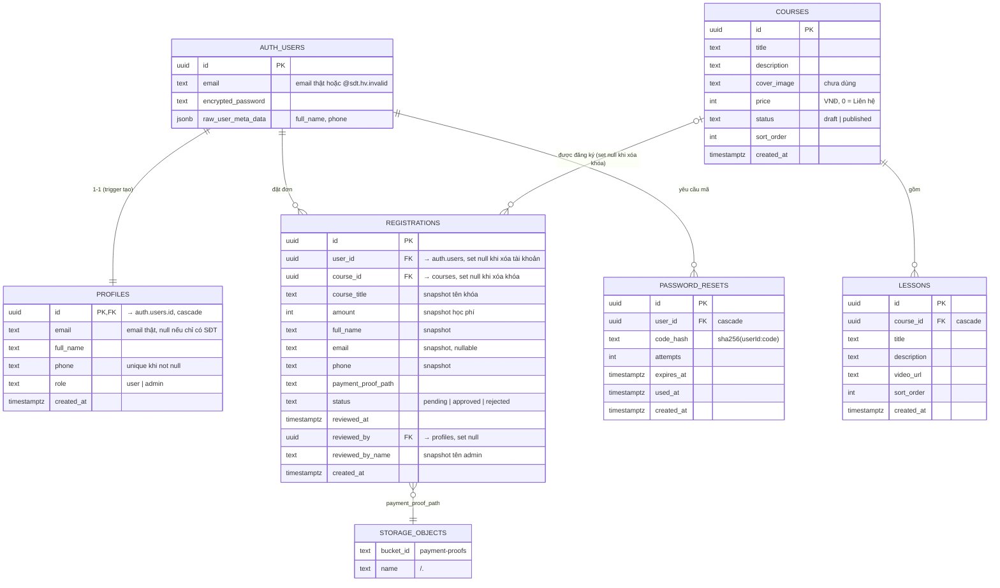

# Thiết kế cơ sở dữ liệu

Nguồn sự thật: `supabase/schema.sql` (PostgreSQL trên Supabase). Tài liệu này giải thích ý nghĩa và
ràng buộc; khi hai nơi lệch nhau, **sửa cả hai**.

## 1. Sơ đồ quan hệ (ERD)



## 2. Từ điển dữ liệu

### 2.1. `public.profiles`
Thông tin hồ sơ, 1-1 với `auth.users`. Tạo tự động bởi trigger.

| Cột | Kiểu | Null | Mặc định | Ràng buộc / ý nghĩa |
| --- | --- | --- | --- | --- |
| `id` | uuid | ✗ | — | PK, FK `auth.users(id)` **on delete cascade** |
| `email` | text | ✓ | — | Email thật (chữ thường). `null` với tài khoản chỉ có SĐT. **Không** unique ở DB (unique do Auth) |
| `full_name` | text | ✓ | — | Họ tên |
| `phone` | text | ✓ | — | SĐT chuẩn hóa `0xxxxxxxxx`. Unique index một phần `profiles_phone_key … where phone is not null` |
| `role` | text | ✗ | `'user'` | `check (role in ('user','admin'))` |
| `created_at` | timestamptz | ✗ | `now()` | |

### 2.2. `public.courses`

| Cột | Kiểu | Null | Mặc định | Ý nghĩa |
| --- | --- | --- | --- | --- |
| `id` | uuid | ✗ | `gen_random_uuid()` | PK |
| `title` | text | ✗ | — | Tên khóa học |
| `description` | text | ✓ | — | Mô tả ngắn (hiển thị tối đa 3 dòng ở thẻ) |
| `cover_image` | text | ✓ | — | **Dự phòng**, chưa dùng ở UI (roadmap R-03) |
| `price` | int | ✗ | `0` | Học phí VNĐ. `constraint courses_price_nonnegative check (price >= 0)`; server giới hạn ≤ 1 tỷ |
| `status` | text | ✗ | `'published'` | `check (status in ('draft','published'))` |
| `sort_order` | int | ✗ | `0` | Thứ tự hiển thị tăng dần |
| `created_at` | timestamptz | ✗ | `now()` | |

### 2.3. `public.lessons`

| Cột | Kiểu | Null | Mặc định | Ý nghĩa |
| --- | --- | --- | --- | --- |
| `id` | uuid | ✗ | `gen_random_uuid()` | PK |
| `course_id` | uuid | ✗ | — | FK `courses(id)` **on delete cascade** |
| `title` | text | ✗ | — | |
| `description` | text | ✓ | — | Hiển thị giữ xuống dòng (`whitespace-pre-line`) |
| `video_url` | text | ✗ | — | Link YouTube/TikTok gốc (xem ADR-005) |
| `sort_order` | int | ✗ | `0` | |
| `created_at` | timestamptz | ✗ | `now()` | |

Index: `lessons_course_id_idx (course_id, sort_order)`.

### 2.4. `public.registrations`

| Cột | Kiểu | Null | Mặc định | Ý nghĩa |
| --- | --- | --- | --- | --- |
| `id` | uuid | ✗ | `gen_random_uuid()` | PK |
| `user_id` | uuid | ✓ | — | FK `auth.users(id)` **on delete set null** – `null` nghĩa là tài khoản đã bị xóa, đơn vẫn giữ làm lịch sử (RK-03) |
| `course_id` | uuid | ✓ | — | FK `courses(id)` **on delete set null** – `null` nghĩa là khóa đã bị xóa, đơn vẫn giữ làm lịch sử |
| `course_title` | text | ✓ | — | Snapshot tên khóa lúc đăng ký (đơn cũ được điền tự động khi chạy schema) |
| `amount` | int | ✓ | — | Snapshot học phí lúc đăng ký (VNĐ) – dùng cho lịch sử thanh toán / báo cáo doanh thu |
| `full_name` | text | ✗ | — | Snapshot tại thời điểm đăng ký |
| `email` | text | ✓ | — | Snapshot email thật (đã bỏ `not null`) |
| `phone` | text | ✗ | — | Snapshot SĐT |
| `payment_proof_path` | text | ✗ | — | Đường dẫn trong bucket `payment-proofs` |
| `status` | text | ✗ | `'pending'` | `check (status in ('pending','approved','rejected'))` |
| `reviewed_at` | timestamptz | ✓ | — | Thời điểm admin xử lý gần nhất (trigger ghi) |
| `reviewed_by` | uuid | ✓ | — | Admin xử lý gần nhất, FK `profiles(id)` **on delete set null** (trigger ghi `auth.uid()`) |
| `reviewed_by_name` | text | ✓ | — | Snapshot tên admin lúc xử lý (`full_name` → `email` → `phone`), hiển thị ở cột "Người xử lý" |
| `review_note` | text | ✓ | — | Lý do từ chối / thu hồi (học viên thấy). Trigger xóa khi về pending; không đổi được nếu `status` không đổi |
| `created_at` | timestamptz | ✗ | `now()` | |

Index: `registrations_user_idx (user_id, course_id, status)` – phục vụ `has_course_access` và kiểm tra trùng;
`registrations_status_idx (status, created_at)` – phục vụ tab admin;
`registrations_active_key` **unique** `(user_id, course_id) where status in ('pending','approved')` – chặn đơn trùng kể cả khi gửi đồng thời (BR-34, RK-07).
Nếu dữ liệu cũ đang có đơn trùng, `schema.sql` bỏ qua bước tạo index và in cảnh báo; xử lý đơn trùng rồi chạy lại.

### 2.5. `public.password_resets`

| Cột | Kiểu | Null | Mặc định | Ý nghĩa |
| --- | --- | --- | --- | --- |
| `id` | uuid | ✗ | `gen_random_uuid()` | PK |
| `user_id` | uuid | ✗ | — | FK `auth.users(id)` cascade |
| `code_hash` | text | ✗ | — | `sha256(userId:code)` dạng hex |
| `attempts` | int | ✗ | `0` | Số lần nhập sai |
| `expires_at` | timestamptz | ✗ | — | `created_at + 10 phút` |
| `used_at` | timestamptz | ✓ | — | Đã dùng / bị vô hiệu |
| `created_at` | timestamptz | ✗ | `now()` | Dùng để giới hạn gửi lại 60 giây |

Index: `password_resets_user_idx (user_id, created_at desc)`.

### 2.6. `public.registration_events` (lịch sử xử lý đơn)

| Cột | Kiểu | Null | Mặc định | Ý nghĩa |
| --- | --- | --- | --- | --- |
| `id` | uuid | ✗ | `gen_random_uuid()` | PK |
| `registration_id` | uuid | ✗ | — | FK `registrations(id)` on delete cascade |
| `actor` | uuid | ✓ | — | Admin thực hiện, FK `profiles(id)` on delete set null; null = service role / hệ thống |
| `actor_name` | text | ✓ | — | Snapshot tên admin |
| `from_status`, `to_status` | text | ✗ | — | Trạng thái trước → sau |
| `note` | text | ✓ | — | Lý do (nếu có) |
| `created_at` | timestamptz | ✗ | `now()` | |

Index: `registration_events_registration_idx (registration_id, created_at)`. Chỉ trigger `registrations_stamp_review` ghi.

### 2.7. `public.role_events` (nhật ký phân quyền)

| Cột | Kiểu | Null | Mặc định | Ý nghĩa |
| --- | --- | --- | --- | --- |
| `id` | uuid | ✗ | `gen_random_uuid()` | PK |
| `user_id` | uuid | ✓ | — | Tài khoản được đổi quyền, FK `profiles(id)` on delete set null |
| `user_name` | text | ✓ | — | Snapshot tên tài khoản |
| `actor`, `actor_name` | uuid, text | ✓ | — | Admin thực hiện (null = script / service role) |
| `from_role`, `to_role` | text | ✗ | — | `user` ↔ `admin` |
| `created_at` | timestamptz | ✗ | `now()` | |

Index: `role_events_user_idx (user_id, created_at desc)`. Chỉ trigger `profiles_guard_role` ghi.

### 2.8. `public.rate_limits` (giới hạn tần suất)

| Cột | Kiểu | Null | Mặc định | Ý nghĩa |
| --- | --- | --- | --- | --- |
| `key` | text | ✗ | — | PK. VD `register:<IP>`, `login-fail:<IP>:<SĐT/email>`, `login-fail-ip:<IP>`, `forgot:<IP>` |
| `window_start` | timestamptz | ✗ | `now()` | Bắt đầu khung đếm hiện tại |
| `hits` | int | ✗ | `0` | Số lần trong khung |

RLS bật, không policy (chỉ service role). Hàm `hit_rate_limit(p_key, p_limit, p_window_seconds, p_increment default true)`:
`security definer`, chỉ `service_role` được `execute`; cửa sổ cố định; `p_increment = false` chỉ kiểm tra;
thỉnh thoảng (1%) dọn khóa cũ hơn 1 ngày.

## 3. Hàm & trigger

| Tên | Loại | Bảo mật | Mô tả |
| --- | --- | --- | --- |
| `handle_new_user()` | trigger function | `security definer`, `search_path = public` | Sau khi insert `auth.users`: tạo profile với `email` (bỏ email nội bộ), `full_name`, `phone` từ `raw_user_meta_data`; `on conflict (id) do nothing` |
| `on_auth_user_created` | trigger | — | `after insert on auth.users for each row` |
| `is_admin()` | SQL, `stable` | `security definer` | `exists(profiles where id = auth.uid() and role = 'admin')` |
| `has_course_access(target_course uuid)` | SQL, `stable` | `security definer` | `is_admin() or exists(registrations where user_id = auth.uid() and course_id = target_course and status = 'approved')`. Được gọi cả trong RLS lẫn qua RPC ở trang chi tiết khóa |
| `stamp_registration_review()` | trigger function | `security definer`, `search_path = public` | Khi `status` đổi: về `pending` → xóa `reviewed_at/by/by_name`; trạng thái khác → `now()`, `auth.uid()`, tên admin từ `profiles`. Khi `status` không đổi → giữ nguyên giá trị cũ (không sửa tay được; riêng `reviewed_by` được về `null` để khóa ngoại hoạt động khi xóa admin) |
| `guard_role_change()` | trigger function | `security definer`, `search_path = public` | Khi `profiles.role` đổi: chặn tự gỡ quyền admin của mình; `pg_advisory_xact_lock` rồi chặn gỡ admin cuối cùng; ghi `role_events` |
| `profiles_guard_role` | trigger | — | `before update of role on profiles for each row` |
| `registrations_stamp_review` | trigger | — | `before update on registrations for each row`. Mỗi lần đổi `status` ghi thêm 1 dòng `registration_events` (kèm `review_note`). Cập nhật bằng service role (không có phiên) → `reviewed_by` null |

> Lưu ý: nếu SĐT trong `raw_user_meta_data` trùng một profile khác, trigger vi phạm unique index →
> **toàn bộ** việc tạo user thất bại ("Database error creating new user"). Ứng dụng kiểm tra trùng trước (`isPhoneTaken`).

## 4. Row Level Security

| Bảng | Thao tác | Policy | Điều kiện |
| --- | --- | --- | --- |
| profiles | SELECT | `profiles_select` | `auth.uid() = id or is_admin()` |
| profiles | UPDATE | `profiles_admin_update` | `is_admin()` |
| profiles | INSERT/DELETE | — | Không ai (chỉ trigger/service role) |
| courses | SELECT | `courses_select` | `status = 'published' or has_course_access(id)` (đã gồm `is_admin()`; học viên đã duyệt đọc được khóa đang ẩn) |
| courses | INSERT / UPDATE / DELETE | `courses_admin_*` | `is_admin()` |
| lessons | SELECT | `lessons_select` | `has_course_access(course_id)` |
| lessons | INSERT / UPDATE / DELETE | `lessons_admin_*` | `is_admin()` |
| registrations | SELECT | `registrations_select` | `auth.uid() = user_id or is_admin()` |
| registrations | UPDATE | `registrations_admin_update` | `is_admin()` |
| registrations | INSERT/DELETE | — | Chỉ service role |
| password_resets | Mọi thao tác | — (RLS bật, không policy) | Chỉ service role |
| registration_events | SELECT | `registration_events_admin_select` | `is_admin()`. Không có policy ghi/sửa/xóa (chỉ trigger) |
| role_events | SELECT | `role_events_admin_select` | `is_admin()`. Không có policy ghi/sửa/xóa (chỉ trigger) |
| storage.objects (`payment-proofs`) | SELECT | `payment_proofs_admin_select` | `bucket_id = 'payment-proofs' and is_admin()` |
| storage.objects (`payment-proofs`) | INSERT/UPDATE/DELETE | — | Chỉ service role |

Ma trận quyền theo vai trò: [07-security/security-design.md](../07-security/security-design.md#3-ma-trận-phân-quyền).

## 5. Storage

| Bucket | Public | Giới hạn | MIME cho phép | Cấu trúc đường dẫn |
| --- | --- | --- | --- | --- |
| `payment-proofs` | ✗ | 5 MB (5242880) | image/png, image/jpeg, image/webp, image/heic, image/heif | `<user_id>/<uuid>.<ext>` |

Truy cập đọc: admin tạo signed URL 1 giờ (`createSignedUrls(paths, 3600)`).

> Khi xóa khóa học hoặc tài khoản, đơn vẫn còn nên ảnh vẫn được tham chiếu. Ảnh chỉ mồ côi khi đơn bị xóa thủ công (RV-08).

## 6. Truy vấn chính & index phục vụ

| Nghiệp vụ | Truy vấn | Index |
| --- | --- | --- |
| Trang chủ | `courses where status='published' order by sort_order` | (bảng nhỏ, không cần) |
| Kiểm tra quyền xem bài | `registrations where user_id=? and course_id=? and status='approved'` | `registrations_user_idx` |
| Tab admin | `registrations where status=? order by created_at limit 200` + đếm theo status | `registrations_status_idx` |
| Danh sách bài | `lessons where course_id=? order by sort_order` | `lessons_course_id_idx` |
| Đăng nhập bằng SĐT | `profiles where phone=?` | `profiles_phone_key` |
| Đăng nhập bằng email | `profiles where email=?` | `profiles_email_idx` (RV-13) |
| Mã reset gần nhất | `password_resets where user_id=? [and used_at is null] order by created_at desc limit 1` | `password_resets_user_idx` |
| Tìm học viên | `profiles where full_name/email/phone ilike '%q%'` | Full scan (chấp nhận với < 10k dòng; lớn hơn dùng `pg_trgm`) |

## 7. Vòng đời dữ liệu & xóa

| Hành động | Ảnh hưởng |
| --- | --- |
| Xóa user trong Supabase Auth | Cascade xóa `profiles`, `password_resets`; `registrations.user_id` → `null`, **đơn và ảnh chuyển khoản được giữ** (RK-03). Nếu user là admin: `registrations.reviewed_by` → `null`, `reviewed_by_name` vẫn còn |
| Xóa khóa học | Cascade xóa `lessons`; `registrations.course_id` → `null`, **đơn và ảnh chuyển khoản được giữ** |
| Xóa bài học | Chỉ xóa bài học |
| Thu hồi đơn | `status = 'rejected'`, giữ nguyên dữ liệu |

## 8. Dữ liệu cấu hình ngoài database

Thông tin ngân hàng, hotline, bác sĩ nằm trong `lib/site-config.ts` (thay đổi cần deploy lại).
Nếu muốn admin tự sửa trên giao diện → tạo bảng `settings` (roadmap R-11).

## 9. Đề xuất cải tiến schema (chưa áp dụng)

Đã áp dụng 26/09/2026: unique index chặn trùng đơn (`registrations_active_key`), người xử lý (`reviewed_by`, `reviewed_by_name`);
Đợt 3: `review_note`, `registration_events`, `role_events`.

```sql
```
