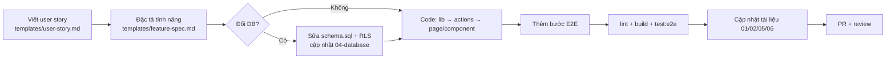

# Hướng dẫn phát triển

## 1. Chuẩn bị

- Node.js **22+** (bắt buộc từ `@supabase/supabase-js` 2.117 – Node 20 báo "native WebSocket not found"; `package.json` `engines`), npm.
- Chrome hoặc Edge (cho E2E).
- Tài khoản Supabase (project dev riêng, **không** dùng production để phát triển).
- VS Code + extension: ESLint, Tailwind CSS IntelliSense, Markdown Preview Mermaid Support.

```bash
npm install
cp .env.local.example .env.local   # điền khóa
npm run dev
```

## 2. Quy ước code

### Chung
- TypeScript cho mọi file ứng dụng; script Node dùng `.mjs`.
- Import tuyệt đối qua alias `@/` (`@/lib/...`, `@/components/...`).
- **Comment và thông báo người dùng bằng tiếng Việt**, ngắn gọn, giải thích *vì sao* hơn là *cái gì*.
- Không thêm thư viện nếu vài chục dòng code tự viết giải quyết được (xem ADR-001, A6).
- Tên file component: `PascalCase.tsx`; tên file lib: `kebab-case.ts`; server action: `actions.ts` cạnh `page.tsx`.

### Next.js
- Mặc định là **Server Component**. Chỉ thêm `'use client'` khi cần state, effect, event handler, API trình duyệt.
- Đọc dữ liệu trong Server Component bằng `await createClient()` từ `@/lib/supabase/server` (Next 15: hàm async vì `cookies()` async).
- Next 15: `params` / `searchParams` của page là **Promise** (`const params = await props.params`); `cookies()`, `headers()`, `setFlash()`, `clientIp()` phải `await`.
- **Không dùng `loading.tsx`** (Next 15.5 hủy điều hướng khi trang chỉ đổi `?tham-số` / redirect sau server action và dữ liệu lớn – RK-53); trạng thái chờ đã có thanh tiến trình `NavigationProgress`.
- Trang động công khai muốn lưu đệm (ISR) phải có `generateStaticParams()` (trả `[]` nếu tạo khi có người truy cập) – xem `app/khoa-hoc/[courseId]/page.tsx`.
- Ghi dữ liệu bằng Server Action trong `actions.ts` với `'use server'` ở đầu file.
- Form không redirect: `ActionForm` + `SubmitButton`, action trả `ActionResult`.
- Form có redirect: action gọi `setFlash()` rồi `redirect()`.
- Form nhiều bước/giữ trạng thái: `useActionState` (`react`) với kiểu State riêng; `useFormStatus` vẫn từ `react-dom`.
- Sau khi ghi dữ liệu ảnh hưởng trang công khai: `revalidatePath('/', 'layout')`.
- **Không** gọi `cookies()`/`headers()` trong `app/layout.tsx` và `app/page.tsx` (giữ ISR – ADR-008).
- **Trang cần quyền**: gọi đầu trang `requireUserPage(path)` (bệnh nhân), `requireStaffPage()` (mọi trang `/admin/**`) hoặc `requireAdminPage()`
  (trang chỉ admin). Middleware chỉ kiểm tra đăng nhập bằng cookie, **không** kiểm tra vai trò (ADR-016).
- Lấy người dùng hiện tại luôn qua `getCurrentUser()` (đã cache theo request) – không tự gọi `supabase.auth.getUser()` nhiều lần.
- Client component cần profile (header, hộp nhắc): dùng `useProfile()` trong `lib/use-profile.ts`, không tự truy vấn `profiles`.
- Form tạo mới đặt trong trang có bộ lọc qua URL: đặt `key` theo bộ lọc để form tạo lại khi chuyển tab (giá trị mặc định đúng).

### Chạy trên Cloudflare Workers (Đợt 17 – ADR-017)
- Production chạy trong **workerd**, không phải Node đầy đủ: không dùng `fs`, `child_process`, thư viện cần TCP thô (VD `nodemailer` – đã thay bằng
  `lib/smtp-workers.ts`) hay binary native (`sharp`). Thêm thư viện mới → chạy `npx opennextjs-cloudflare build` + `npm run test:e2e:workers`.
- IP người dùng chỉ lấy qua `clientIp()` (`cf-connecting-ip`) – **không** đọc `x-forwarded-for` trực tiếp (RK-43).
- Module chỉ chạy ở server (service role, gửi mail, giới hạn tần suất, sinh mật khẩu…) mở đầu bằng `import 'server-only'` (SEC-03).
- Action công khai **không** trả nguyên `error.message` của database / SMTP cho khách: trả thông báo chung, ghi `console.error` (xem ở Workers Logs) – SEC-02.
- Deploy từ máy Windows: `npm run deploy:win` (không dùng `npm run deploy` – treo ở bước D1).
- Biến môi trường: `NEXT_PUBLIC_*` nhúng lúc build; khóa bí mật đặt Secret trên Cloudflare, chạy thử trên máy dùng `.dev.vars` (không commit).
- Không cần `getCloudflareContext()` trừ khi dùng trực tiếp R2 / D1 / KV.

### Supabase
- Chọn đúng client (xem system-architecture.md §3). Service role chỉ khi **bắt buộc**.
- Mutation cần xác nhận có tác dụng: thêm `.select('id')` và kiểm tra `data.length`.
- Không tin dữ liệu từ client; validate lại ở server.
- Trigger giữ nguyên cột (chống sửa tay) mà cột đó có khóa ngoại `on delete set null`: cho phép cột **về null** (bài học RK-22, RK-29).
- Dữ liệu nội bộ không cho người dùng đọc: bảng riêng + RLS, hoặc hàm `security definer` trả cột an toàn (RLS không ẩn được từng cột).
- Hàm tổng hợp nội bộ (VD `_patient_courses`): không `security definer`, `revoke execute … from public, anon, authenticated`, chỉ gọi từ hàm đã kiểm tra quyền.

### Styling
- Dùng Tailwind utility; lặp lại ≥ 3 lần → tạo class trong `@layer components` của `globals.css`.
- Chỉ dùng màu trong design system (`ocean`, `gold`, `slate`, `emerald`, `red`).
- Mobile-first: viết style cho điện thoại trước, thêm `sm:`/`lg:` sau.

## 3. Quy trình thêm một tính năng



### Ví dụ: thêm cột "Lý do từ chối" (US-09.05)

1. `schema.sql`: `alter table public.registrations add column if not exists review_note text;`
2. `app/admin/actions.ts`: `setRegistrationStatus` nhận thêm `note` từ `FormData`.
3. `app/admin/page.tsx`: thêm ô nhập lý do trong form Từ chối.
4. `app/courses/page.tsx`: hiển thị `review_note` trong "Đơn chưa được xác nhận".
5. `scripts/e2e.mjs`: bước từ chối có nhập lý do, học viên thấy lý do.
6. Tài liệu: database-design (cột mới), api-specification (tham số mới), screen-specifications (SCR-07, SCR-10), user-stories (đổi US-09.05 sang ✅).

## 4. Thay đổi database

Hiện tại (ADR-010): sửa `supabase/schema.sql` theo kiểu **idempotent**:

| Muốn | Viết |
| --- | --- |
| Thêm bảng | `create table if not exists …` + `alter table … enable row level security` + policy |
| Thêm cột | `alter table … add column if not exists …` |
| Thêm/sửa policy | `drop policy if exists "<tên>" on …; create policy "<tên>" …` |
| Thêm/sửa hàm | `create or replace function …` (luôn `set search_path = public` nếu `security definer`) |
| Index | `create index if not exists …` |
| Đổi tên / xóa | Viết khối có điều kiện; ghi chú rõ phiên bản cũ; cân nhắc migration riêng |

Khi dự án có staging/production, chuyển sang Supabase CLI:
```bash
npx supabase init
npx supabase link --project-ref <ref>
npx supabase db diff -f ten_thay_doi     # sinh file migrations/<timestamp>_ten_thay_doi.sql
npx supabase db push                     # áp dụng lên project đã link
```

## 5. Git workflow (đề xuất)

> Repository đã được khởi tạo (26/09/2026, nhánh `main`, `.gitattributes` chuẩn hóa xuống dòng LF).
> Việc còn lại: tạo repo **private** trên GitHub, `git remote add origin <url>`, `git push -u origin main`, bật CI (mục 6).

- Nhánh: `main` (production) · `feature/<mô-tả>` · `fix/<mô-tả>`.
- Commit theo Conventional Commits: `feat: …`, `fix: …`, `docs: …`, `refactor: …`, `test: …`, `chore: …`.
- PR phải: mô tả thay đổi, link user story, ảnh chụp UI (nếu có), checklist DoD (test-plan §6).
- Không commit: `.env*.local`, `test-results/`, `.next/`, `node_modules/`.

## 6. CI đề xuất (GitHub Actions)

```yaml
name: ci
on: [pull_request]
jobs:
  check:
    runs-on: ubuntu-latest
    steps:
      - uses: actions/checkout@v4
      - uses: actions/setup-node@v4
        with: { node-version: 20, cache: npm }
      - run: npm ci
      - run: npm run lint
      - run: npx tsc --noEmit
      - run: npm run build
        env:
          NEXT_PUBLIC_SUPABASE_URL: ${{ secrets.STAGING_SUPABASE_URL }}
          NEXT_PUBLIC_SUPABASE_ANON_KEY: ${{ secrets.STAGING_SUPABASE_ANON_KEY }}
      # E2E cần Chrome + service role staging: chạy ở job riêng, thủ công hoặc theo lịch
```

## 7. Nâng cấp phụ thuộc

| Nâng cấp | Việc cần làm |
| --- | --- |
| Next.js 15 | ✅ Đợt 17 (15.5): `cookies()` / `headers()` / `params` / `searchParams` async, `createClient()` server async, `useActionState`, `generateStaticParams` cho trang ISR động |
| @supabase/ssr ≥ 0.6 | ✅ Đợt 17 (0.12): cookie adapter `getAll`/`setAll` (middleware, server client) |
| React 19 | ✅ Đợt 17, đi cùng Next 15 |
| Next.js 16 | Chờ `@opennextjs/cloudflare` hỗ trợ đầy đủ middleware `proxy` (Node) trước khi nâng |
| Tailwind 4 | Cấu hình chuyển sang CSS (`@theme`); kiểm tra `@apply` trong `globals.css` |

Sau mỗi lần nâng cấp: `npx opennextjs-cloudflare build` + `npm run test:e2e:workers` (chuẩn), `npm run build` + `npm run test:e2e` (Node) đầy đủ.
