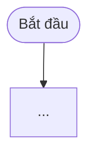

# Đặc tả tính năng: <Tên> (<ID roadmap / US>)

| Mục | Nội dung |
| --- | --- |
| Tác giả | |
| Ngày | |
| Trạng thái | Draft / Review / Approved / Done |
| User stories | US-… |
| Người duyệt | |

## 1. Bối cảnh & mục tiêu
Vấn đề gì? Ai gặp? Đo thành công bằng chỉ số nào?

## 2. Phạm vi
- Trong phạm vi:
- Ngoài phạm vi:

## 3. Luồng người dùng


## 4. Thiết kế giao diện
- Màn hình mới / thay đổi (SCR-xx), wireframe ASCII hoặc link Figma.
- Trạng thái: loading / rỗng / lỗi / thành công.
- Responsive: điện thoại / máy tính.
- Accessibility: checklist trong `06-ui-ux/design-system.md §6`.
- Nội dung chữ (UX writing): tiêu đề, nút, thông báo lỗi/thành công.

## 5. Thiết kế dữ liệu
```sql
-- SQL idempotent sẽ thêm vào supabase/schema.sql
```
- RLS: ai được đọc/ghi? (cập nhật ma trận trong `07-security`)
- Migrate dữ liệu cũ?

## 6. Thiết kế API / Server Action
| Action / Route | Input | Kiểm tra | Output | Thông báo |
| --- | --- | --- | --- | --- |

## 7. Bảo mật & quyền riêng tư
- Dữ liệu nhạy cảm? Service role có cần không, vì sao?
- Rủi ro lạm dụng? Rate limit?

## 8. Kiểm thử
- Bước E2E mới:
- Unit test:
- Kiểm thử thủ công:

## 9. Triển khai
- Thứ tự: DB → code → cấu hình.
- Biến môi trường mới:
- Rollback:

## 10. Tài liệu cần cập nhật
- [ ] srs.md · [ ] business-rules.md · [ ] user-stories.md · [ ] database-design.md
- [ ] api-specification.md · [ ] screen-specifications.md · [ ] test-plan.md · [ ] README.md
